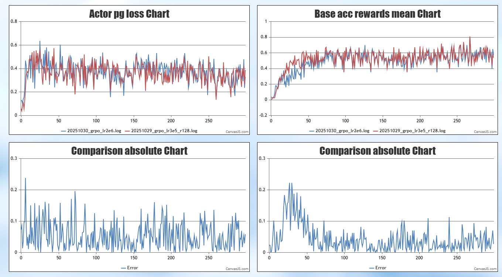

# GRPO-LoRA
 
## 背景介绍
针对大模型对齐训练中面临的**显存与通信资源高昂**痛点，以及模型部署后需支持单基座**多业务并行**（multi-lora推理）的实际应用场景，我们提出了 GRPO-LoRA 方案：
GRPO-LoRA 核心思想是将组相对策略优化（Group Relative Policy Optimization, GRPO）与低秩适应（Low-Rank Adaptation, LoRA）技术结合。在训练过程中，通过冻结基座模型（Backbone）参数，仅更新低秩适配器（Adapter），大幅降低显存占用与通信开销。同时，针对推理与训练的分布式策略差异，实现了权重的动态转换与合并，确保在不侵入 vLLM 源码的前提下实现高效 Rollout。通过该能力，我们能够以极低的资源成本实现大模型的对齐训练。

## 使用方法
```yaml
megatron_config:
  lora_r: 128       # LoRA rank，表示低秩矩阵的维度，该值越大表示可学习的参数越多，一般为32，64，128
  lora_alpha: 128      # LoRA 的缩放系数，表示低秩矩阵对主干的影响，一般为lora_r的1或2倍
  lora_fusion: true     # 是否启用CCLoRA算法，该算法通过计算通信掩盖提高性能
  lora_target_modules: ["linear_qkv", "linear_proj", "linear_fc1", "linear_fc2"] # 选择需要添加 LoRA 的模块
  lora_filter: true    # 是否只保存LoRA模块

rl_config:
  share_backbone: True       # 是否开启 Actor 与 Reference 模型共享主干

```
## 技术方案
### LoRA 的原理
GRPO-LoRA 中的 LoRA 模块构造继承自 MindSpeed-LLM 框架，模型在 `get_model_provider` 阶段通过构造 MindSpeed LLM 框架内置的 LoRA 模块完成初始化。关于具体的低秩矩阵分解原理、权重转换（如 mg2hf）脚本以及更多细节，请参见: [MindSpeed-LLM LoRA 官方文档链接](https://gitcode.com/Ascend/MindSpeed-LLM/blob/master/docs/pytorch/solutions/finetune/lora_finetune.md)

### Share Backbone 机制

1. Backbone 逻辑复用代替物理拷贝：当配置 `share_backbone: True` 时，Actor Model 与 Reference Model 共享完全相同的基座模型权重（Backbone），显著节省了重复加载大型 Backbone 权重所需的装卸时间开销。
2. 动态上下文切换： Actor 前向正常累加 LoRA Adapter 的输出，Reference 前向通过 `with self.model.disable_adapter()` 上下文管理器临时屏蔽 LoRA 分支，仅计算 Backbone 输出。
3. 适用范围：该机制仅支持基于 Integrated Worker 架构实现的算法，对于 DAPO 等天然无需 Reference Model 的算法，系统将在初始化阶段阻断。

<p align="center">  </p>

<div align="center">
图1 Actor/Reference 逻辑复用示意图
</div>

### vLLM 推理集成
1. LoRA 权重转换：在进入 Rollout 阶段前，系统自动识别训练时的 TP/PP 策略与 vLLM 配置的 TP/PP 策略差异。将分布在不同节点 上的 LoRA 权重按照 Rollout 的分布式结构进行重新切分和重组。
2. 权重合并与推理：将转换后的 LoRA 权重 add 到对应的 Backbone 权重中，vLLM 引擎直接加载合并后的完整模型进行推理。这种方式规避了 vLLM 对 LoRA 算子的额外开销，又保证了推理引擎的纯净性和升级兼容性。

<p align="center">  </p>

<div align="center">
图2 训练态到推理态的权重转换与合并流程
</div>

## 验证情况
### 资源效率 
对于qwen2.5-32b，使用4k上下文训练数据，仅需 16x 32GB NPUs 即可稳定训练。相关配置见[配置文件](../../configs/grpo_lora_qwen25_32b_A2.yaml)
### 效果对齐
在 DeepScaler 数据集上进行验证，当 LoRA Rank 设置为 128 时，GRPO-LoRA 在 Reward 增长趋势和 Loss 收敛曲线上与全参数微调（Full Fine-tuning）基本保持一致，证明了该方案在大幅节省资源的同时未牺牲模型效果。

对照试验基本配置如下：
<div style="margin: 0 auto; width: 50%;">

| | 硬件配置 | 学习率 | gbs | n_sample | mbs | lora alpha | lora r |
| :--- | :---: | :---: | :---: | :---: | :---: | :---: | :---: |
| **全参数** | 32x 32GB NPUs | 2e-6 | 32 | 8 | 32 | 不涉及 | 不涉及 |
| **lora** | 16x 32GB NPUs | 3e-5 | 32 | 8 | 32 | 128 | 128 |

</div>
Reward 和 Loss 对比结果如下：
<p align="center"> 
     
</p>

<div align="center">
图3 LoRA (r=128) 与全参数微调的 Reward 和 Loss 对比曲线
</div>