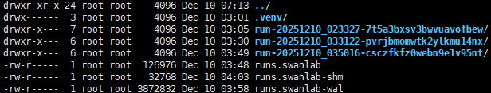
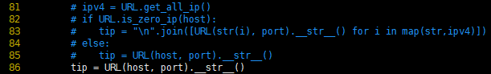

# MindSpeed RL 训练指标可视化
## 简介

- SWANLAB 是机器学习领域广泛使用的实验跟踪与可视化工具。功能全面，可以展示丰富的数据类型，包括训练曲线，图片，视频，表格，html，matplotlib图像等，SwanLab对比WandB部署更容易，更安全，更易用，并且可以离线。
- MindSpeed RL支持训练指标的可视化：SwanLab和WandB二选一使用。

## 使用示例
### Swanlab使用
MindSpeed RL使用开源库Swanlab能力
### 官方网址
https://docs.swanlab.cn

#### 前置准备
```
# 推荐使用新版 board 扩展
pip install "swanlab[board]"
pip install loguru
# 旧版兼容
# pip install "swanlab[dashboard]"
# pip install loguru
```
#### 参数配置
**在训练yaml文件的rl_config字段中添加：**
```
# 开启tensorboard，若use_tensorboard和use_swanlab同时为True，则tensorboard不生效
use_tensorboard: true   
```

#### 参数配置
**在训练yaml文件的rl_config字段中添加：**
```
# 开启 SwanLab
use_swanlab: true 
 
# SwanLab 模式
swanlab: local 或者 swanlab: cloud # 开启swanlab时必填 
 
# SwanLab 项目名称
swanlab_project: "The_swanlab_project_name"  # 开启swanlab时必填

# SwanLab 实验名称
swanlab_exp_name: "The_swanlab_experiment_name"  # 开启swanlab时必填

# SwanLab 本地日志保存路径（建议绝对路径）
swanlab_save_dir: "Path_to_save_the_swanlab_results_locally" # 开启swanlab时必填
```

#### 云端模式（需要网络，将上传到 SwanLab 云端）
swanlab_mode 如果为 cloud
则需要提前swanlab login 
详情请见 
https://docs.swanlab.cn/guide_cloud/general/quick-start.html


#### 查看可视化指标
Step1. cd 进入 本地日志保存路径 参数配置里的这个路径
```
cd "Path_to_save_the_swanlab_results_locally"
```
  
Step2.*执行命令*
```
swanlab watch . -host xxxx -port xxxx
```
*成功后会显示*  
  
访问IP:端口就能看到训练可视化内容  
  

注：
>1. 如果遇到如下问题  
    File "xxxxxx/lib/python3.11/site-packages/swanboard/run/run.py", line 83, in run
    tip = "\n".join([URL(i, port).__str__() for i in ipv4])
          ^^^^^^^^^^^^^^^^^^^^^^^^^^^^^^^^^^^^^^^^^^^^^^^^^
TypeError: sequence item 0: expected str instance, Text found

可以按照下列方式修改
```
vi /usr/local/lib/python3.10/site-packages/swanboard/run/run.py
## 注释掉81-85 然后 86 行添加 tip = URL(host, port).__str__() 示例如下
# ipv4 = URL.get_all_ip()
# if URL.is_zero_ip(host):
#    tip = "\n".join([URL(str(i), port).__str__() for i in map(str,ipv4)])
# else:
#    tip = URL(host, port).__str__()
tip = URL(host, port).__str__()
```  

