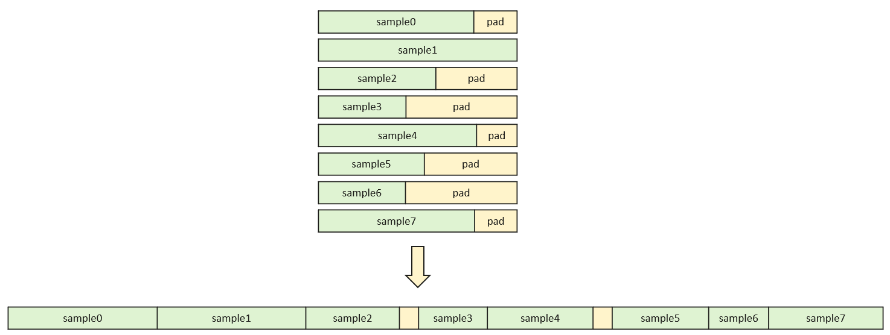
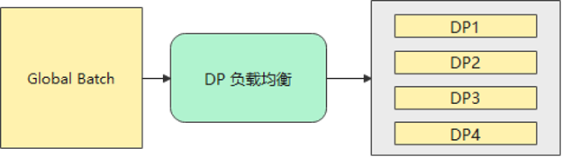

# 特性说明

本文档介绍了两项在大语言模型训练中用于加速、节省显存的关键特性：

1. **填充移除（Remove padding）**  
2. **动态批量大小（Dynamic Batch Size）**
3. **数据并行负载均衡（DP Batch Balance）**

---

# ✂ 填充移除（Remove Padding）特性说明

## 背景介绍

在大语言模型训练过程中，输入数据通常由长度不一的序列组成。为了支持批处理，传统方案通过在 batch 内对所有序列填充（padding）至相同长度实现。这种方式虽然方便模型计算，但会引入大量无效计算，尤其当短序列远多于长序列时，训练效率显著下降。

为了解决上述问题，我们引入了 **remove_padding** 特性，通过对有效 token 部分拼接（packing）后计算，有效消除了 padding token 带来的资源浪费，提升了训练效率。

## 实现原理

1. **预处理阶段**：移除每个序列中的 padding，然后将所有有效 token 拼接为一条长序列，同时记录每个子序列的起始位置和长度。
2. **前向计算阶段**：将拼接后的序列输入模型计算，attention mask 可手动构造或利用 FlashAttention 自动生成。
3. **后处理还原阶段**：根据记录信息，将 logits 拆解还原为原始样本对应的维度。

<p align="center">
  
</p>

<p align="center">
  
</p>

## 配置方法

```yaml
megatron_training:
  variable_seq_lengths: true
  reset_position_ids: true

rl_config:
  use_remove_padding: true
```

# 📦 动态批大小（Dynamic Batch Size）特性说明

## 背景介绍

在使用 `remove_padding` 技术拼接多个序列以提高训练效率时，若不加限制地拼接过多序列，可能导致拼接后的总 token 数量超出 GPU 显存容量，进而发生 OOM（Out Of Memory）错误。

为此，我们引入了 **Dynamic Batch Size（动态批大小）** 特性：根据每条样本的实际 token 长度，动态地划分多个 micro batch，确保每个子 batch 拼接后的 token 总数不超过指定的最大值 `max_packing_token_size`。该机制在保持高吞吐的同时，有效避免显存溢出问题。

---

## 实现原理

1. **Token 总长限制**  
   - 对于一个 batch 中的每一个样本，根据其 `prompt_length + response_length` 计算总 token 长度列表；
   - 将这些 token 长度进行合理划分，使每组（micro batch）拼接后的 token 总数不超过 `max_packing_token_size`。

2. **智能分组算法**  
   - 采用 **Karmarkar-Karp 近似平衡分组算法** 进行序列分配；
   - 最小化各组之间 token 总数的不均衡，同时控制最大 token 长度。

3. **兼容数据并行**  
   - 在分布式训练中（如使用 torch.distributed），对 `max_packing_token_size` 的计算支持同步广播，以保证各 rank 上划分一致。

---

## 参数说明：max_packing_token_size

`max_packing_token_size` 是动态批大小（Dynamic Batch Size）机制中的核心参数，用于限制每个拼接后的 micro batch 中 token 的总数，防止因拼接过多序列而导致显存溢出（OOM）。  

**使用限制**：每条样本的 token 长度必须满足：
```text
prompt_length[i] + response_length[i] <= max_packing_token_size
```

**建议值**：通常设置为序列最大长度的2倍，即：
```text
max_packing_token_size = (rl_config.max_prompt_length + generate_config.sampling_config.max_tokens) * 2
```
可以根据实际需求调整。

---

## 配置方法

在配置文件中添加如下字段：

```yaml
rl_config:
  use_dynamic_bsz: true
  max_packing_token_size: 8192
```

# 📦 数据并行负载均衡（DP Batch Balance）特性

## 背景介绍

在数据并行（Data Parallel, DP）训练中，若各 DP 节点的序列总长度不均衡，会导致计算量少的节点提前完成等待，形成「木桶效应」。该特性通过装箱算法均衡各 DP 节点的序列总长度，减少节点间等待时间，提升分布式训练效率。

## 实现原理

1. **序列长度收集**：获取当前批次所有样本的序列长度；
2. **动态装箱分组**：使用堆排序装箱算法，按序列长度从大到小依次分配至当前总长度最小的分组，确保各 DP 节点的总序列长度均衡；
3. **数据分配**：将分组后的样本分配至各 DP 节点，实现计算量均衡。

<p align="center">
  
</p>

## 配置方法

```yaml
rl_config:
  use_dp_batch_balance: true
```