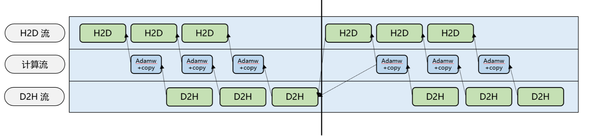

# Swap Optimizer

## 背景介绍

在大模型训练中，通常使用BF16格式进行前向和反向传播计算，而在梯度更新时使用 FP32格式。这导致优化器需要同时保存FP32格式的权重和两个FP32格式的动量，显存占用为 `参数量 * 12` Bytes。

这部分显存在前反向阶段并不会被使用，且会推高显存峰值，导致模型训练 OOM。

虽然可以通过使用分布式优化器等技术减少显存占用，但这类优化手段的效果依赖于数据并行（DP）数量，且无法完全消除这部分额外的显存开销。

## 解决思路

为了降低显存峰值，本特性将优化器状态卸载到主机端内存（host），仅在设备端（device）保留必要的逻辑视图。在每次参数更新时，优化器状态会从主机端内存重新加载到设备端。通过这种方式，显著减少了设备端的显存占用，避免了因显存不足（OOM）导致的训练中断，从而提高了训练的稳定性。

## 解决方案

1. ​**优化器初始化**​：在初始化阶段，当执行 `shard_fp32_from_float16_groups` 操作时，优化器会从模型的权重（BF16 格式）中复制权重到优化器的 FP32 格式。在每次复制权重时，为了避免冲击显存峰值，必须将权重及时交换到主机端。权重加载时同样会进行 swap 操作。由于这一过程仅在初始化阶段进行，因此对性能的影响可以忽略不计。
2. **Step 阶段处理**​：在每次训练的 step 阶段，为了实现 host 到 device（H2D）和 device 到 host（D2H）的并行操作，优化器首先会一次性将约 `numel(shard_fp32_from_float16_groups) // swap_optimizer_times` 大小的参数从主机端传输到设备端（H2D）。接着，执行 AdamW 优化计算，并将结果复制回模型的 BF16 权重。最后，再进行 D2H 操作，释放设备端的显存。
3. **异步拷贝保证时序正确**​：由于 D2H 和 H2D 操作是异步进行的，为确保数据传输时序的正确性，第二轮的 D2H 操作需要等待第一轮的 H2D 操作完成之后才会执行。



## 使用介绍

swap_optimizer特性仅适用于使用了分布式优化器`use_distributed_optimizer`且`optimizer_selection：fused_adamw`的模型训练场景，需要通过以下配置进行使能：

`use_distributed_optimizer: true`： 使用分布式优化器。

`optimizer_selection：fused_adamw`： 优化器选用fused_adamw。

`swap_optimizer：true`： 开启 swap optimizer 特性。

`swap_optimizer_times: [int]`： [int]值默认为16，用于设置 step 更新阶段进行 swap 的次数，越大并行的越多，可减少性能劣化，但会提高显存峰值。

推荐配置

```bash
export CPU_AFFINITY_CONF=1,lazy_bind:0
```

此配置启用粗粒度绑核模式，将任务绑定至NPU对应的NUMA CPU核心，可有效避免跨NUMA内存访问，减少调度开销，从而提升计算稳定性与性能。

## 使用效果

开启swap-optimizer特性能够有效减少训练过程中 device 侧的显存占用，缓解因显存溢出（OOM）导致的训练中断问题。

## 注意事项

1. 本特性仅适用于开启分布式优化器`use_distributed_optimizer`且`optimizer_selection`为`fused_adamw`的模型训练场景
2. 本特性与 `reuse_fp32_param`、fused ema adamw优化器等其他优化器相关特性暂不兼容。
