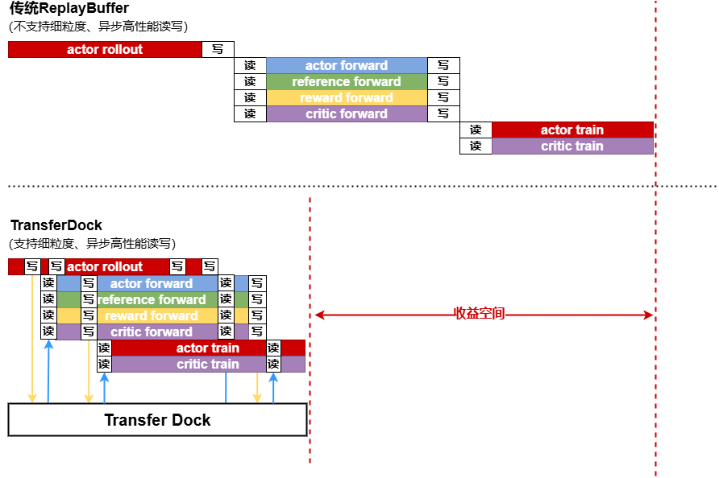
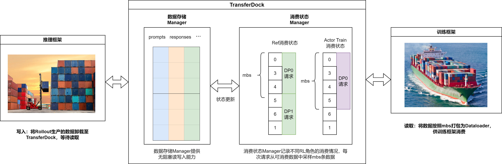
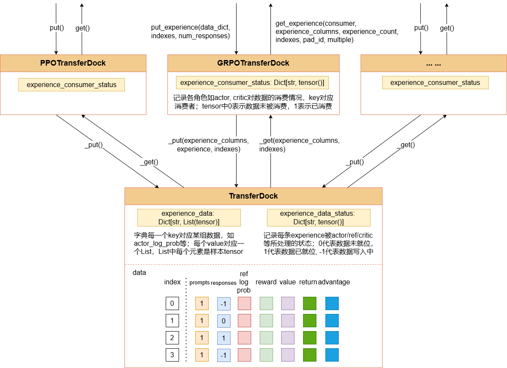
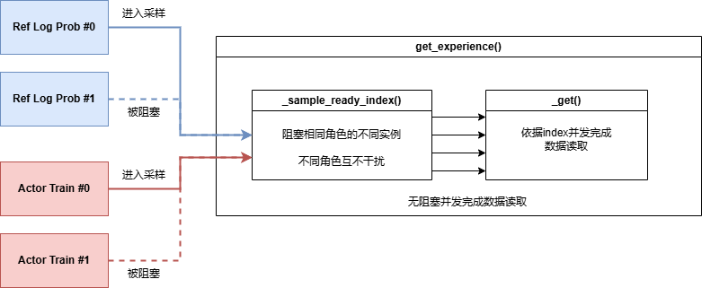
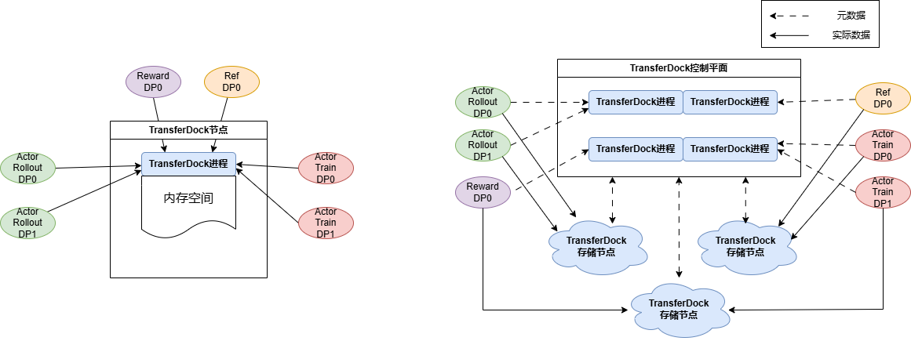

# TransferDock：异步高并发数据转运机制

## 背景介绍

在分离式架构中，Actor Rollout、Ref Forward、Critic Forward、Actor Forward、Actor Train、Critic Train等不同计算任务存在数据流程依赖。传统ReplayBuffer不支持细粒度、异步高性能读写，**需按序等待各个计算任务完全完成才能启动后续任务**，造成较大**流水空泡**与**计算资源浪费**。为解决此问题，提出TransferDock模块，以mbs为粒度实现各个计算任务的异步、高性能读写。



如上图所示，TransferDock可支持各个RL任务按照mbs粒度进行无阻塞读写，从而实现各个RL任务之间的掩盖。考虑到一般Actor Rollout约占端到端时间的80%，理想情况下引入TransferDock可将训练任务除最后一个mbs外完全掩盖，**取得接近10~20%的收益**。

## 方案概述
TransferDock在LLM后训练系统中连接了推理框架与训练框架，扮演了**转运港口**的角色：

1. 推理框架将一个mbs的数据（集装箱）卸载至TransferDock；
2. TransferDock将数据解包为单条数据（拆箱），重新排布并更新生产消费状态；
3. 训练引擎请求数据，TransferDock按照其所需的mbs大小重新打包（装箱），并装载至Dataloader（装船）发送给训练引擎。




### 设计抽象
在TranserDock中，构建了一个数据存储Manager，用于存储、维护RL后训练中所需要的各类数据，如`prompts`, `responses`, `old_log_prob`等。此外，还维护了一个消费状态Manager，用于记录各个RL角色的数据消费情况，确保数据读写不重不漏。数据存储Manager采用Index进行访问；消费状态Manager则提供了扫描数据生产消费状态，并按照Index读写数据存储Manager的能力。


### 具体实现
TransferDock在实现时采用分层设计，基类TransferDock通过index+信号量进行异步并发操作，避免线程锁的引入，实现高性能读写；上层提供与RL算法耦合的GRPOTransferDock派生类，维护各个RL角色的生产/消费状态，为用户提供友好的数据读写接口，实现各个RL角色间的无阻塞读写。



### 高并发设计

在设计过程中，对异步高并发场景进行了细致考虑。具体地，RL后训练过程涉及以下两种不同的并发场景：

* RL**角色间**异步读写：如actor_rollout, ref, reward, actor_train, critic_train等，这些RL角色会异步地向TransferDock进行读写数据请求
* RL**角色内**异步读写：对非训练过程的RL角色，其各路DP之间存在异步数据读写，导致数据争抢

针对以上并发场景，TransferDock实现了尽可能的无阻塞数据读写。具体地，代码实现将一次访问拆解为**数据采样**与**数据读写**两个过程。

数据采样过程针对用户在外侧不指定Index的场景（例如，各类读请求），此时需依赖派生类扫描并采样出可被读写的Index。若用户直接指定了Index（例如，各类写请求需先读出数据和Index，再按Index写回），则直接进入数据读写过程。在数据读写过程中，依据派生类采样出的Index或用户指定的Index进行读写，完全消除了数据阻塞。


|并发场景|使用方式|数据采样过程|数据读写过程|
|:----|:----|:----:|----:|
|RL角色间|给定Index访问|无阻塞|无阻塞|
|RL角色间|随机访问|无阻塞|无阻塞|
|RL角色内|给定Index访问|无阻塞|无阻塞|
|RL角色内|随机访问|有阻塞|无阻塞|

综上，TransferDock在实现过程中充分考虑了异步高并发场景，可支持大规模后训练任务。



> 特别地，使能异步模式时需将`configs/XXX.yaml`中的blocking设置为false

以`grpo_trainer_qwen25_7b.yaml`为例，
```yaml
rl_config:
  blocking: false # 设置为false，可开启异步模式以允许不同RL角色无阻塞启动
```

## 开发原理
### 初始化
TransferDock在Trainer类中进行初始化，其引用作为参数传递给后训练过程中的各个Worker。

`mindspeed_rl/trainer/grpo_trainer_hybrid.py` 
```python
def transfer_dock_init(self):
    self.transfer_dock = GRPOTransferDock.remote(self.global_batch_size, self.metrics, addition_columns=self.dataset_additional_keys)
    self.actor_worker.sync_init_transfer_dock(self.transfer_dock)
    self.ref_worker.sync_init_transfer_dock(self.transfer_dock)
    for reward in self.reward_list:
        if hasattr(reward, 'sync_init_transfer_dock'):
            reward.sync_init_transfer_dock(self.transfer_dock)
        else:
            reward.init_transfer_dock.remote(self.transfer_dock)
```

### Trainer主控逻辑
在Trainer的主训练逻辑中，将TransferDock的使用隐式包含在各个Worker的任务中。当各个任务的入参`blocking`设置为`False`时，则开启异步模式，允许各个训练任务间的异步数据读写，使能各个任务之间的流水掩盖。

`mindspeed_rl/trainer/grpo_trainer_hybrid.py` 
```python
# generate sequences
self.actor_worker.generate_sequences(blocking=self.blocking)

# compute reference log_prob
self.ref_worker.compute_log_prob(blocking=self.blocking)

# compute rm scores.
for reward_worker in self.reward_list:
    if isinstance(reward_worker, RayActorGroup):
        reward_worker.compute_rm_score(blocking=self.blocking)
    else:
        self.rule_reward_compute_rm_score(reward_worker, blocking=self.blocking)

# compute advantages, executed on the driver process
self.compute_advantage(blocking=self.blocking)

self.actor_worker.wait_all_ref_objs_run_over()
# compute old log_prob
self.actor_worker.compute_log_prob(blocking=self.blocking)

# update actor
self.actor_worker.update(self.kl_ctrl)
```

### Worker读写逻辑

以`generate_sequences()`为例，进一步分析其具体使用过程。首先，需定义自身的RL角色，并指定所需要读写的列名。每个mbs循环，都将依照`self.all_consumed()`状态确定是否要继续读取数据，其中令TP0&PP0访问TransferDock中的数据消费状况，并同步至DP域内其他rank。

Worker类中实现了`self.dispatch_transfer_dock_data()`和`self.collect_transfer_dock_data()`两个函数，这两个函数将完成从TransferDock中读写数据的功能。读数据时，令TP0&PP0从TransferDock中完成实际数据读取，并利用HCCL广播至DP域内其他设备；写数据时，令TP0&Last PP将最终结果写回TransferDock，完成数据写入。

`mindspeed_rl/workers/actor_hybrid_worker.py` 
```python
experience_consumer_stage = 'actor_rollout'
experience_colums = ['prompts', 'prompt_length']
experience_count = self.rl_config.experience_count_actor // self.generate_config.data_parallel_size

self.sharding_manager.reshard_to_infer_mode()
pad_token_id = self.tokenizer.pad if self.tokenizer.pad else self.tokenizer.eod

while self.all_consumed(experience_consumer_stage) > 0:
    batch_data, index = self.dispatch_transfer_dock_data(
        experience_consumer_stage,
        experience_colums,
        experience_count,
        n_samples_per_prompt=self.rl_config.n_samples_per_prompt,
        tp_size=self.megatron_config.tensor_model_parallel_size,
        use_vllm=True
    )


    # do inference
    output = None
    # after inference

    self.collect_transfer_dock_data(outputs, index, self.rl_config.n_samples_per_prompt, use_vllm=True)
```

## 未来演进



如上图左侧所示，当前TransferDock采用单节点设计，各路DP均会向单一节点发送读写请求，在千卡以上大规模训练时可能成为瓶颈。未来TransferDock将进一步支持分布式存储，将控制平面与数据平面分离，管理节点维护数据状态，实际数据读写过程将分布在各个存储节点中，从而缓解网络带宽瓶颈与IO瓶颈。