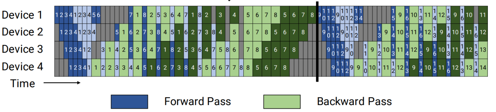

# VPP/DPP

## 数据并行

### 背景介绍

在面对大规模数据集的模型训练场景时，单一计算设备往往难以承载整个数据集的处理负荷，导致训练周期过长。为应对这一挑战，需将原始数据集进行有效分割，确保每台计算设备仅需处理数据集的一部分，从而实现训练效率的显著提升。

### 方案介绍

#### Data Parallelism

数据并行 (Data Parallelism，DP) 策略通过将数据集划分为多个批次（Batch），并将其均匀分配至各个计算设备，使得每台设备仅负责处理特定批次的数据。

此方案的实施需满足以下两点关键要素： 每一台计算设备上部署的模型结构与参数保持完全一致。 各设备处理的数据批次互不相同，确保训练过程的并行性和效率。 该方案的整体思路如下：

* 模型复制：在每个计算设备（GPU）上存储完整的模型副本。
* 数据分割：原始数据集被细分为若干个批次，然后均匀分配至各个计算设备，确保负载均衡。
* 梯度同步：每块计算GPU（worker）完成前向计算并获取局部梯度后，梯度聚合GPU（Server）汇集所有计算GPU的梯度，计算平均值，再将结果下发广播回各设备，以此维持全局参数的一致性。聚合再下发梯度的操作，称为All Reduce。

对于某些模型而言，仅依靠单一的并行策略往往是不够的，在现实运用场景中，往往采用两种或多种并行技术，以实现更好的可扩展性、效率和硬件利用率。

典型的混合架构可能如下所示，结合了数据并行(DP)，流水线并行(PP)和张量并行（TP）, 共八个GPU，对前四个GPU运用张量并行和流水线并行，并将该设置复制到剩余的GPU。

##### 图1 混合流水线并行示意图（TP=4 PP=4 DP=2）


### 使用介绍

#### Data Parallelism

数据并行的启用与参数配置与以下指标有关：

* NPU数量（World Size）：参与并行训练的所有NPU数量。
* 模型并行数（Tensor Model Parallel Size）：模型权重的并行分割数。
* 流水线并行数（Pipeline Model Parallel Size）：模型架构的流水线并行度。
* 长序列并行数（Context Parallel Size）：针对长序列数据处理的并行策略。
* 数据并行数(data_parallel_size) = world_size // (tensor_model_parallel_size * pipeline_model_parallel_size * context_parallel_size)

注意：
模型总层数需被流水线并行数整除。
global_batch_size需被data_parallel_size整除。

当前仓通过如下配置可以使能, 其中`tensor_model_parallel_size`和`pipeline_model_parallel_size`的值根据实际情况进行调整：

```yaml
actor_config:
   tensor_model_parallel_size: 4 ## 跟模型转换里面保持一致
   pipeline_model_parallel_size: 2 ## 跟模型转换里面保持一致
```

## 虚拟流水线并行

### 背景介绍

Megatron流水线并行策略(pipeline parallel)虽能有效分割模型，但在运行过程中仍存在较高的空泡率，计算资源利用率仍有提高空间。

### 方案介绍

#### 虚拟流水线并行

为了解决这一问题，虚拟流水线并行技术被提出，旨在通过进一步细分计算任务，降低空泡比率，提升训练效率。

虚拟流水线并行（Virtual Pipeline Parallelism，VPP）的核心在于，在不增加设备数量的前提下，将模型进一步细分为更多阶段，以增加通信量为代价，换取更低的空泡比率。在设备数量不变的情况下，分出更多的流水线阶段，以更多的通信量，换取空泡比率降低。

##### 图2 虚拟流水线并行示意图



[原文链接](https://people.eecs.berkeley.edu/~matei/papers/2021/sc_megatron_lm.pdf)

例如，假设模型总层数为16，张量并行大小为1，流水线并行大小为4，虚拟流水线并行大小为2，则模型将被划分为4 * 2 = 8个阶段，每个阶段包含16 / 8 = 2个层。如下所示：

```
Device 0: [1, 2] [9, 10]
Device 1: [3, 4] [11, 12]

Device 2: [5, 6] [13, 14]
Device 3: [7, 8] [15, 16]
​
```

前向的顺序为 Device 0 -> Device 1 -> Device 2 -> Device 3 -> Device 0 -> Device 1 -> Device 2 -> Device 3

### 使用介绍

#### 虚拟流水线并行

虚拟流水线并行依赖流水线并行。

启用虚拟流水线并行，需在训练脚本中加入以下参数配置：

```yaml
actor_config:
   num_layers_per_virtual_pipeline_stage  N  ## N表示每个虚拟流水线阶段的层数
​
```

同时在权重转换脚本中，也加入` num_layers_per_virtual_pipeline_stage N`

此外，开启该特性时，要求模型总层数 num_layers % N == 0，且pipeline_model_parallel_size大于等于2。

virtual_pipeline_model_parallel_size(vpp) = num_layers // (pipeline_model_parallel_size * num_layers_per_virtual_pipeline_stage)

##### 注意：

Megatron虚拟流水线并行（VPP）对权重的分割模式具有直接影响。在保存或加载权重文件时，务必保持VPP配置参数的一致性，以确保模型权重的准确加载和系统的稳定运行。
