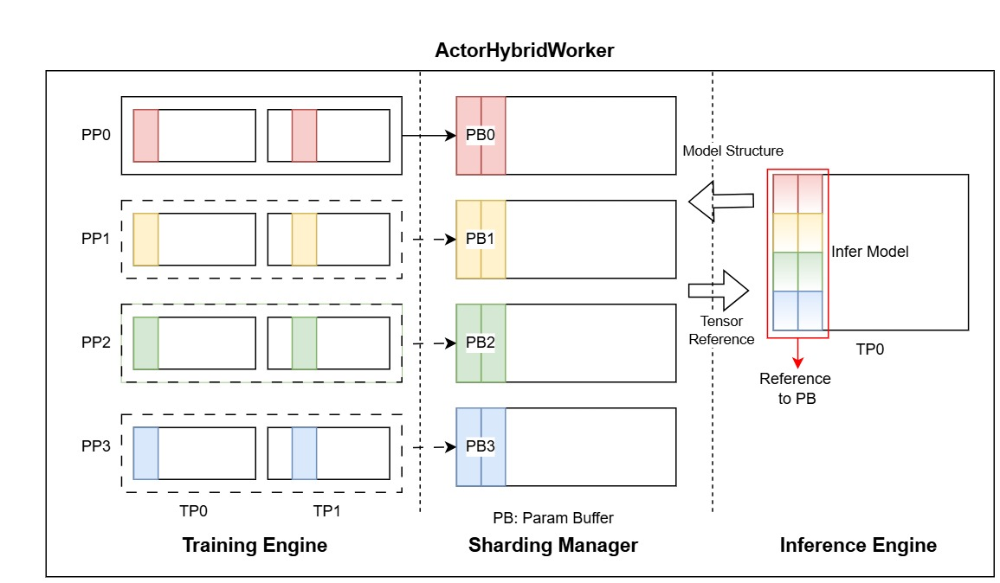

# 训推共卡机制介绍

## 背景介绍

在 GRPO、PPO 等 RLHF 算法中，主要耗时会集中在推理阶段，所以通常会使用专门的推理引擎（如 vLLM 等）对推理过程进行加速。 
因此，Actor 模型在训练过程中会同时存在推理态和训练态两种模式，在每轮训练中，Actor 模型需要在训练态和推理态间切换。


如果采用分离方案进行 Actor 部署，即将 Actor 推理态与训练态部署在不同的物理资源上，可能导致训练推理任务相互等待，资源利用率低。
即使采用了 MBS 间异步方案提升利用率，分离式部署的资源需求量也会远大于共卡部署方案，因此 Actor 共卡方案在资源量较为有限的情况下，是一种资源高效的部署方式。

## 技术概述

因此，本仓库提出一种强化学习后训练优化方案：训推共卡方式 Actor 部署。
该方案的核心在于通过训练与推理任务分时复用同一集群资源实现高效协同。具体而言，该方案包含以下关键技术：
1. 动态权重更新与并行策略转换：通过通信优化算法减少训推切换时的权重同步时延，并支持在线将专家并行（EP）转换为张量并行（TP），解决大规模 MoE 模型（如DeepSeek V3）因权重庞大（1.3TB）导致的内存溢出（OOM）问题。
2. 内存调度优化：在推理阶段将训练相关的优化器状态和梯度卸载至Host侧内存，降低NPU内存峰值，同时提升推理吞吐；训练时再将数据重新加载至 NPU 完成更新。
3. 训推任务无缝切换：基于 Megatron 和 vLLM 框架实现 Actor 模型的生成、推理、训练三阶段串行执行，通过分时复用资源减少模型级空泡，提升硬件利用率。

上述设计的主要优势包括：

1. 资源利用率提升：训推共卡避免了传统分离架构中资源闲置问题，尤其在MoE模型场景下显著降低卡数需求；
2. 高效适配复杂负载：支持训练（大TP/PP/小EP并行）与推理（小TP/PP/大EP并行）的不同并行策略需求，优化系统吞吐；
3. 低成本部署：通过内存卸载和权重转换技术，降低大规模模型训练的硬件门槛。

### 设计抽象
训推共卡的 Actor 被实现为 `ActorHybridWorker` ，该类继承了 `BaseWorker` ，作为一个角色参与到 GRPO 的训练流程中， 
实现了包括 `generate_sequences`， `compute_log_prob` 和 `update` 的方法，包含了 Actor 在 GRPO 训练流程中的全部功能。
该类主要包括 `model`，`optimizer`，`inference_model`，`sharding_manager` 等成员，其中 `model`和 `optimizer` 是训练态的模型和优化器，当前基于 Megatron 框架实现；
`inference_model` 是推理态的模型，当前基于 vLLM 框架实现；`sharding_manager` 负责实现训推状态的切换，包括从训练状态到推理状态的权重切分转换及相关显存管理功能。



### 具体实现

从训练态切换到推理态时，需要根据推理态的切分从训练权重构建出相应的推理权重，并将训练态的模型权重、优化器和梯度从显存上进行卸载，为推理时的 KV Cache 留出显存空间；
从推理态切换到训练态时，则只需将推理态的权重和KV Cache卸载，并重新加载回训练态的权重、优化器和梯度。


当前框架会自动启用训推共卡式 Actor，在配置文件中，可以对共卡情况下的训练态和推理态模型的切分策略进行分别配置，并设定在推理时是否需要对训练相关权重、梯度和优化器进行卸载。
以 `grpo_trainer_qwen25_7b.yaml` 为例，

```yaml
actor_config:
  tensor_model_parallel_size: 4     # 训练态 TP 切分
  pipeline_model_parallel_size: 1   # 训练态 PP 切分
  expert_model_parallel_size: 1     # 训练态 EP 切分

generate_config:
  infer_tensor_parallel_size: 4     # 推理态 TP 切分
  infer_pipeline_parallel_size: 1   # 推理态 PP 切分
  infer_expert_parallel_size: 1     # 推理态 PP 切分

  offload_train_optimizer: true     # 设置为 true 可以使能在推理时卸载训练态优化器
  offload_train_grad: true          # 设置为 true 可以使能在推理时卸载训练态梯度
  offload_train_param: true         # 设置为 true 可以使能在推理时卸载训练态权重
```


## 开发原理

### 初始化
`ActorHybridWorker` 通过调用自身的 `initialize` 方法实现初始化，在 `initialize` 方法中主要实现了训练态模型的初始化、推理态模型、训练态模型卸载器和 sharding_manager 的初始化。

```python
# mindspeed_rl/workers/actor_hybrid_worker.py

def initialize(self):
    # 初始化分布式环境
    self.setup_distributed_rank()
    
    # 初始化训练态模型及卸载器
    self.model, self.optimizer, self.opt_param_scheduler = self._build_model_optimizer()
    self.megatron_offloader = MegatronOffLoader(self.optimizer, self.model)
    
    # 在初始化推理态模型之前，首先卸载训练态的模型，这样才能让推理模型在初始化时正确计算KV Block的数量
    if self.generate_config.offload_train_optimizer:
        self.megatron_offloader.offload_optimizer()
    if self.generate_config.offload_train_grad:
        self.megatron_offloader.offload_grad()
    if self.generate_config.offload_train_param:
        self.megatron_offloader.offload_train_param()

    # 初始化推理态模型
    self.inference_model = self._build_rollout()
    
    # 初始化 sharding_manager
    self.sharding_manager = self._build_sharding_manager()
    ...
```

### 推理引擎适配

由于推理引擎通常被设计为独立运行的，为了适应在同一进程中运行训推两个任务，我们需要对推理引擎侧做一定的改造，主要包括：
1. 推理引擎初始化时复用训练态模型配置的环境变量来进行分布式环境的初始化，并在此基础上构建相应通信组。
2. 推理引擎构建通信组时要考虑到训推切换的相应策略，以最小化通信代价。
3. 推理引擎需要能够动态的加载绑定由训练态权重构造得到的推理态权重，并切能够对权重进行卸载。

上述三部分改造的主要内容体现在 `mindspeed_rl/models/rollout/vllm_adapter/` 中：

`mindspeed_rl/models/rollout/vllm_adapter/vllm_parallel_state.py` 中 
`initialize_parallel_state` 函数实现了对推理引擎分布式初始化的修改适配。

`initialize_model_parallel_for_vllm` 函数实现了推理引擎根据不同的训推切分策略构建最优通信组，
目前会针对训推转换的不同 TP 变换实现 TP 建组的切换。

```python
# mindspeed_rl/models/rollout/vllm_adapter/vllm_parallel_state.py

def initialize_model_parallel_for_vllm(
    infer_tensor_model_parallel_size: int,
    train_tensor_model_parallel_size: int = 1,
    infer_pipeline_model_parallel_size: int = 1,
    train_pipeline_model_parallel_size: int = 1
) -> None:

    ...
    
    # 根据训推 TP 变换不同会返回不同的 TP 组
    def get_tp_group_ranks():
        if infer_tensor_model_parallel_size > train_tensor_model_parallel_size:
            return get_split_tp_group_ranks()
        else:
            return get_allgather_tp_group_ranks()

    # 根据上述策略实现 vLLM 中的 TP 建组
    _TP = init_model_parallel_group(
        group_ranks=get_tp_group_ranks(),
        local_rank=get_world_group().local_rank,
        backend=backend,
        use_message_queue_broadcaster=True,
    )   
    ...
```

`sync_model_weights` 和 `offload_model_weights` 函数实现了推理引擎动态加载和卸载权重的功能，
内部会进一步依赖 `vllm_adapter/megatron_weight_loaders.py` 中的相关方法。
```python
# mindspeed_rl/models/rollout/vllm_adapter/vllm_parallel_state.py

def sync_model_weights(self, params, load_format='megatron'):
    infer_parallel_config = InferParallelConfig(self.infer_tensor_parallel_size, self.infer_pipeline_parallel_size,
                                                self.infer_expert_parallel_size)
    load_megatron_weights(params,
                          self.model,
                          infer_parallel_config,
                          self.hf_config)
    if hasattr(self.model.model.layers[0].self_attn, "mla_attn"):
        self._process_mla()

def offload_model_weights(self):
    for name, params in self.model.named_parameters():
        params.data = self.cpu_model[name]
```


### Trainer主控调用
Actor 训推切换的逻辑被完全封装在 `ActorHybridWorker` 类内部，在主控只需要直接调用该类的方法完成相应计算任务，而无需关注训推切换过程的细节。

```python
# mindspeed_rl/trainer/grpo_trainer_hybrid.py

actor_worker = RayActorGroup(
    worker=ActorHybridWorker,
    placement_group=pgs,
    megatron_config=actor_config,
    rl_config=rl_config,
    generate_config=generate_config,
    model_provider=gpt_model_provider,
    tokenizer=tokenizer,
    initialize_func=initialize_megatron,
    get_megatron_module=get_megatron_module,
    global_batch_size=actor_config.global_batch_size * rl_config.n_samples_per_prompt
).initialize()

while iteration < self.train_iters:
    ...
    # 调用 Actor 推理态进行生成
    self.actor_worker.generate_sequences(blocking=self.blocking)
    
    ...
    
    # 调用 Actor 训练态计算 log_prob
    self.actor_worker.compute_log_prob(blocking=self.blocking)
    
    ...
    
    # 调用 Actor 训练态进行训练更新
    self.actor_worker.update(self.kl_ctrl)
```

### 训推状态切换
`ActorHybridWorker` 的训推状态切换通过其成员 `sharding_manager` 实现，在需要进行 generate 时，调用 `sharding_manager` 将 `ActorHybridWorker` 切换到推理态，
而在 generate 结束后，会调用 `sharding_manager` 将 `ActorHybridWorker` 重新切换回训练态。

```python
# mindspeed_rl/workers/actor_hybrid_worker.py

def generate_sequences(self):
    ...
    # generate开始前，调用 reshard_to_infer_mode 将 Actor 切换到推理态
    self.sharding_manager.reshard_to_infer_mode()
    ...
    
    while self.all_consumed(experience_consumer_stage) > 0:
        ...
        # 调用 generate_sequences 方法进行推理
        responses_pad_right = self.actor_hybrid.generate_sequences(copy.deepcopy(prompts_list))
        ...
    
    # 推理结束后，调用 reshard_to_train_mode 将 Actor 切换回训练态
    self.sharding_manager.reshard_to_train_mode()
    self.empty_cache()
```

这里的 `self.sharding_manager` 是类 `MegatronShardingManager` 的实例，具体的训推切换方法也是定义在该类中。

```python
# mindspeed_rl/workers/resharding/megatron_sharding_manager.py

class MegatronShardingManager:
    
    def reshard_to_train_mode(self):
        # 卸载推理态相关权重
        self.inference_engine.offload_model_weights()
        self.offload_infer_params()
        torch.cuda.empty_cache()
        
        # 重新加载回训练态所需的内容
        if self.optimizer_offload:
            self.megatron_offloader.onload_optimizer()
        if self.train_param_offload:
            self.megatron_offloader.onload_train_param()
        if self.grad_offload:
            self.megatron_offloader.onload_grad()
        torch.cuda.empty_cache()

    def reshard_to_infer_mode(self):
        
        # 卸载训练态所需的相关参数
        if self.optimizer_offload:
            self.megatron_offloader.offload_optimizer()
        if self.grad_offload:
            self.megatron_offloader.offload_grad()
        torch.cuda.empty_cache()
        
        # 训练态权重要在完成推理权重构建之后才能进行卸载
        # 这里是为了对应初始化后第一次推理时，训练态权重不在显存上的情况
        if self.train_param_offload:
            self.megatron_offloader.onload_train_param()
        
        # 根据训练态和推理态的切分策略，完成推理态权重的构建
        self.onload_infer_params()
        infer_params = self.vllm_weight_container.get_infer_params()
        
        # 开始推理前，将训练态权重进行卸载
        if self.train_param_offload:
            self.megatron_offloader.offload_train_param()
            
        # 将推理态权重从 weight_buffer 绑定到推理引擎上
        self.inference_engine.sync_model_weights(infer_params, load_format='megatron')
        torch.cuda.empty_cache()
```

## 未来演进
MoE大模型大EP推理能够有效进一步增大推理batch size， 实现通算掩盖，提升推理吞吐，昇腾也推出支持训练推理EP变化，使能推理大EP高吞吐推理。