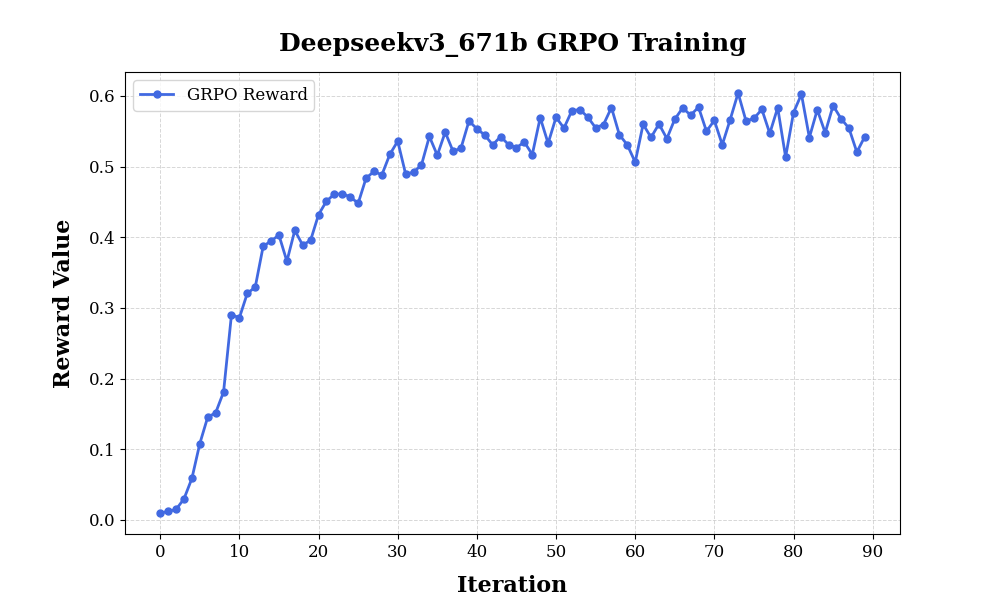
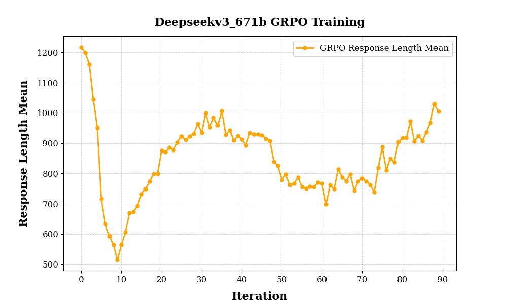
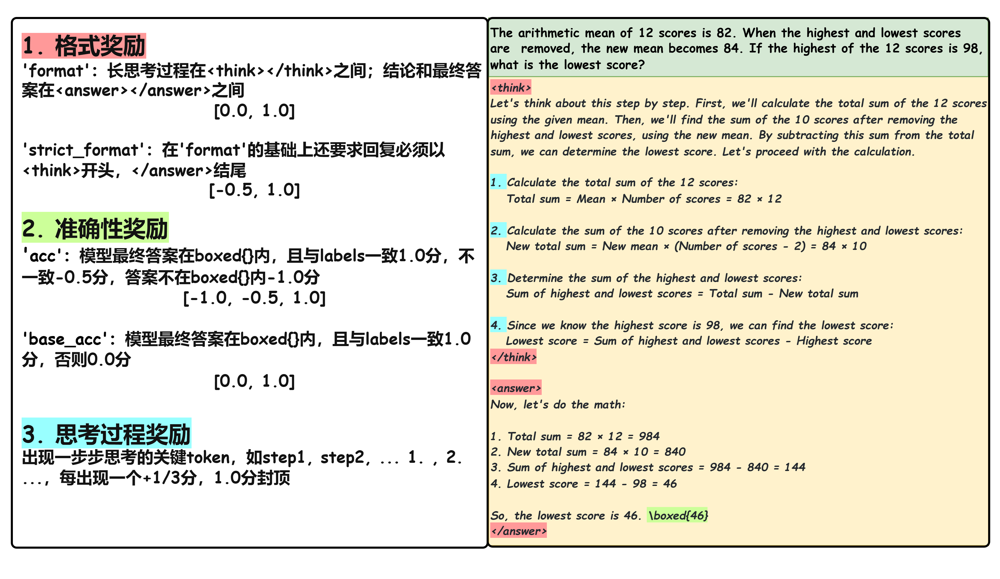

# DeepSeek-R1-Zero-671B
R1-Zero模型是使用base模型，基于GRPO+规则奖励打分进行训练，本篇工作使用DeepSeek-671B Base模型复现DeepSeek-R1-Zero在Math领域的工作。


## 复现效果
### 训练细节

我们使用DeepSeek-671B Base模型在deepscaler数据集上训练，使用标准的格式奖励和准确性奖励，训练超参如下：

|  迭代  | 学习率 |  gbs  |  采样数 | 温度 |  kl-coef | 输入长度 | 输出长度 | 规则奖励 | 奖励模型 |
|:----:|:----:|:----:|:----:|:----:|:----:|:----:|:----:|:----:|:----:|
| 100 | 1e-6 (constant) |  384  |  32  |  1.0  |  0.001  |  1024  |  2048  |  base_acc  | - |

**训练过程记录如下：**

**Reward曲线：**



**Response length曲线：**




## 环境配置
配置MindSpeed-RL基础环境以及准备代码，参考[安装指南](../install_guide.md)

## 模型选择
* DeepSeek-671B-Base [[**下载**]](https://huggingface.co/deepseek-ai/DeepSeek-V3)
该模型指令遵从度高，有一定概率能引导模型输出`<think>...</think><answer>...$\boxed{}</answer>`格式回复，训练曲线符合预期。

### 权重转换
在进行RL训练之前，模型需要从HuggingFace权重转换为megatron权重，可参考[**权重转换部分**](../algorithms/grpo.md)

## 模板构造

* R1-Zero复现需要在数据处理时加上prompt模板激发`<think>...</think><answer>...$\boxed{}</answer>`
  ```
  "A conversation between User and Assistant. The user asks a question, and the Assistant solves it. The assistant first thinks about the reasoning process in the mind and then provides the user with the answer. The reasoning process and answer are enclosed within <think> </think> and <answer> </answer> tags, respectively, i.e., <think> reasoning process here </think><answer> answer here </answer>. Put your final answer within \\boxed{}. <｜User｜>{{content}}<｜Assistant｜>"
  ```
  

* 以上为默认的deepseek3_r1模板，根据模型和数据的不同，用户可以在`configs/model/templates.json`添加自己的**自定义模板**


## 数据集
对于deepseekv3-671B模型我们使用DeepScaler 40K来训练

* [**DeepScaler**](https://huggingface.co/datasets/agentica-org/DeepScaleR-Preview-Dataset/tree/main)

### 数据预处理
需要先配置数据处理的yaml文件(configs/datasets/deepscaler.yaml)
自定义数据集需要设置--map-keys映射，或重写自定义handler；具体参考[**数据集处理部分**](../algorithms/grpo.md)


**DeepSeek-671B**
* 处理的时候默认使用deepseek3_r1的模板

  ```shell
  # 启动转换
  bash examples/data/preprocess_data.sh deepscaler
  ```

## 打分器
DeepSeek-R1-Zero训练的过程中仅使用了基于程序的打分器而没有使用ORM，我们在数学领域上的打分逻辑分为以下几个部分：



## 训练

### 配置准备

模型结构的配置文件位于configs/model下，训练配置文件位于configs/目录下，我们以deepseek-671b的A3配置为例[grpo_deepseek_r1_671b_A3.yaml]，该配置用到了384die。[**参数配置具体含义参考**](../features/grpo_yaml.md)

### 手动启动训练
与基于ray的其他强化训练一样，我们多机需要先在主节点初始化ray：

```shell
# 创建一个集群，端口6344，dashboard端口8260，dashboard-host填写主节点IP
ray start --head --port 6344 --dashboard-host=$MASTER_ADDR --dashboard-port=8260
```

随后，在其他节点加入主节点的集群：
```shell
# IP_ADDRESS 处填写主节点 IP 地址
ray start --address="IP_ADDRESS:6344"
```

最后，在主节点上启动训练：
```shell
export HCCL_CONNECT_TIMEOUT=1800
export CUDA_DEVICE_MAX_CONNECTIONS=1

python cli/train_grpo.py --config-name grpo_deepseek_r1_671b_A3.yaml | tee logs/r1_zero_deepseek_671b_full.log
```

### 脚本启动训练

[**参数配置具体含义参考**](../algorithms/grpo.md)
```shell
# 主节点 在脚本文件中修改节点数、每个节点的卡数以及主节点的IP地址
bash examples/grpo/grpo_trainer_deepseek_r1_671b.sh
```

```shell
# 其余子节点 在脚本文件中修改节点数、每个节点的卡数以及主节点的IP地址
bash examples/grpo/grpo_trainer_deepseek_r1_671b.sh
```


***注意：所有节点的代码、权重、数据等路径的层级要保持一致，且启动ray的时候都位于MindSpeed-RL目录下***
