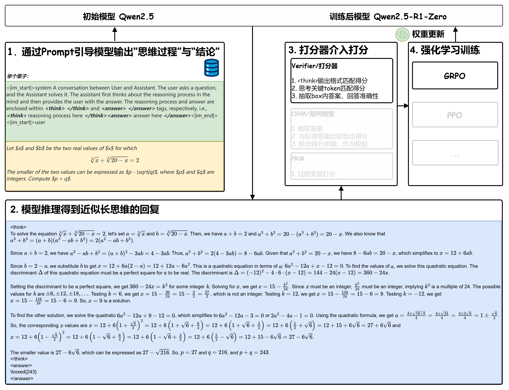
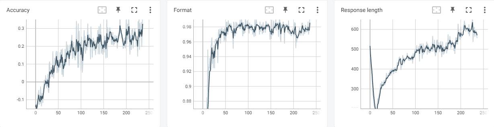
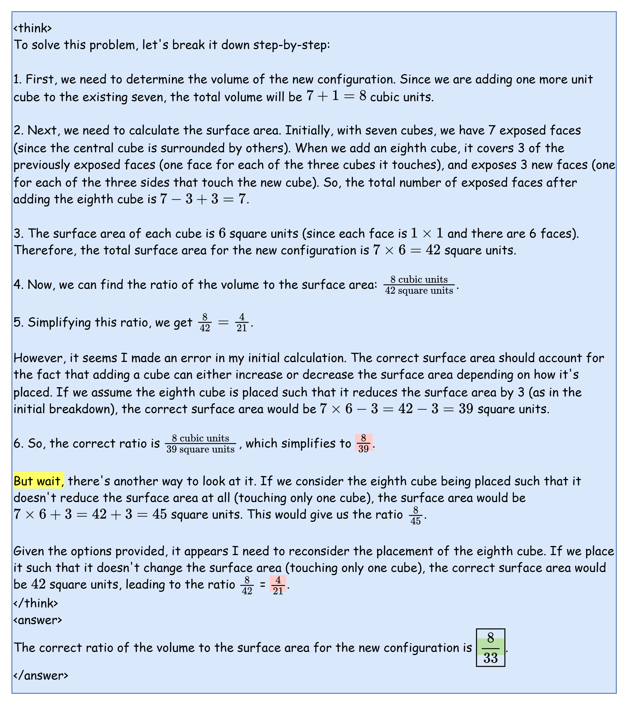
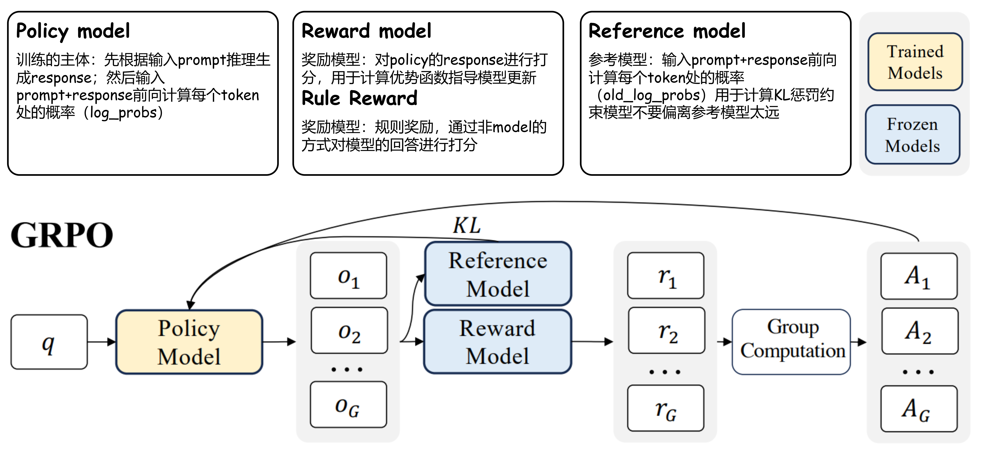

# DeepSeek-R1-Zero(qwen25-32b)
R1-Zero模型是使用base模型，基于GPRO+规则奖励打分进行训练，本篇工作使用Qwen25-32B模型复现DeepSeek-R1-Zero在Math领域的工作

## 整体流程示意图




## 复现效果
### 训练细节
    我们使用Qwen-2.5-32B模型在deepscaler数据集上使用标准的格式奖励和准确性奖励训练；（512+16）*A2约30小时，训练超参如下
|  迭代  | 学习率 |  gbs  |  采样数 | 温度 |  kl-coef | 输入长度 | 输出长度 | 规则奖励 | 奖励模型 |
|:----:|:----:|:----:|:----:|:----:|:----:|:----:|:----:|:----:|:----:|
| 240 | 1e-6 (contant) |  128  |  16  |  0.8  |  0.001  |  1024  |  3072  |  acc + format  | - |

    训练过程用tensorboard记录如下



### 评测结果
---
    我们使用OpenCompass进行评测
|              Model              | MATH 500 (Pass@1) | AIME24  (Avg@32) | GPQA Diamond (Avg@32) |
|:-------------------------------:|:-----:|:-----:|:-----:|
| Qwen-2.5-32B | 68.6 | 4.5 | 32.1 |
| Qwen-2.5-32B + SimpleRL-Zoo | 82.4 | 27.2 | - |
| **Qwen-2.5-32B + MindSpeed-RL** | **83.2** | **30.4** | **41.1** |


### Aha-Moment
---
    我们观察到经过30iter后模型就能出现Aha-Moment，取典型样例如下

- **训练前**

  
- **训练后**

  


## 环境配置
配置MindSpeed-RL基础环境以及准备代码，参考[**安装指南**](../install_guide.md)

## 模型选择
* Qwen2.5-32B [[**下载**]](https://huggingface.co/Qwen/Qwen2.5-32B/tree/main)

### 权重转换
---
在进行RL训练之前，模型需要从HuggingFace权重转换为megatron权重，可参考[**权重转换部分**](../grpo.md)

```bash
source /usr/local/Ascend/ascend-toolkit/set_env.sh

# 设置需要的权重转换参数

# actor使用TP8PP2，将脚本里改成TP8PP2配置
# reference使用TP8PP1，将脚本里改成TP8PP2配置
bash examples/ckpt/ckpt_convert_qwen25_hf2mcore.sh

# 训练完后如需要转回HF格式
bash examples/ckpt/ckpt_convert_qwen25_mcore2hf.sh
```


## 模板构造

* R1-Zero复现需要在数据处理时加上prompt模板激发`<think>...</think><answer>...$\boxed{}</answer>`
  ```
  <|im_start|>system\nYou are a helpful assistant.<|im_end|>\n<|im_start|>user\nA conversation between User and Assistant. The user asks a question, and the Assistant solves it. The assistant first thinks about the reasoning process in the mind and then provides the user with the answer. The reasoning process and answer are enclosed within <think> </think> and <answer> </answer> tags, respectively, i.e., <think> reasoning process here </think><answer> answer here </answer>Put your final answer within \\boxed{}.\n{你真正的问题}<|im_end|>\n<|im_start|>assistant\n{模型真正的回答}
  ```

* 以上为默认的qwen_r1模板，根据模型和数据的不同，用户可以在`configs/templates.json`添加自己的**自定义模板**


## 数据集
对于32B模型应使用更高难度的数据集，所以我们使用DeepScale 40K来训练

* [**DeepScaler**](https://huggingface.co/datasets/agentica-org/DeepScaleR-Preview-Dataset/tree/main)

### 数据预处理
需要先配置数据处理的yaml文件(examples\datasets\r1_zero_qwen25_32b.yaml)
自定义数据集需要设置--map-keys映射，或重写自定义handler；具体参考[**数据集处理部分**](../grpo.md)


**Qwen2.5-32B**
* 处理的时候默认使用qwen_r1的模板

  ```shell
  # 启动转换
  bash examples/data/preprocess_data.sh r1_zero_qwen25_32b
  ```

## 打分器
DeepSeek-R1-Zero训练的过程中仅使用了基于程序的打分器而没有使用ORM，我们在数学领域上的打分逻辑分为以下几个部分：


## 训练
### 背景

```
传统的PPO中需要一个通过广义优势估计（Generalized Advantage Estimation）计算得到的advantage，并依赖于和reward model同结构的需要同步训练的critic model计算得到价值函数(V)
```

```
GRPO通过分组采样n个输出，利用组内的平均奖励作为基线计算每个输出在组内的相对奖励，并基于相对奖励计算优势值，从而避免了引入额外的价值网络（critic model）
```


DeepSeek-R1-Zero的训练过程使用GRPO算法，将ORM（结果奖励模型）替换为基于规则的打分器。

### 配置准备
---

模型结构的配置文件位于configs/model下，训练配置文件位于configs/目录下，我们以qwen2.5-32b为例[r1_zero_qwen25_32b.yaml]，该配置用到了32卡，为了进一步加速可以不断增加推理DP的数量。以下为参数配置：

```yaml
defaults:
  - model:
      - qwen25-32b                        <-- 网络结构需要定义在model目录的yaml文件下

megatron_training:
  global_batch_size: 128                  <-- 每个迭代的总样本数
  ...
  dataset_additional_keys: ['labels',]    <-- 使用打分器时需要的额外字段

actor_config:
  model: qwen25-32b
  micro_batch_size: 1          <-- 训练的mbs
  ...
  lr: 1e-6
  lr_decay_style: constant     <-- 学习率衰减方式
  weight_decay: 0.0            <-- 正则化强度系数
  lr_warmup_fraction: 0.0      <-- 控制学习率预热
  ...
  no_load_optim: false         <-- 续训加载优化器状态
  no_load_rng: false           <-- 续训加载数据随机数生成器
  no_save_optim: false         <-- 保存权重时同时保存优化器状态
  no_save_rng: false           <-- 保存权重时同时保存数据随机数生成器

ref_config:
  model: qwen25-32b
  ...

rl_config:
  blocking: false              <-- 开启异步流水
  ...
  adv_estimator: group_norm    <-- 优势计算方法
  mini_batch_size: 2048        <-- 训练更新梯度的bs, 一般为gbs*n_samples_per_prompt
  ...
  max_prompt_length: 1024      <-- 最大的prompt长度
  clip_ratio: 0.2              <-- 策略裁剪比例
  shuffle_minibatch: false     <-- 策略裁剪比例
  n_samples_per_prompt: 16     <-- GRPO中一个group内生成的response条数
  colocate_actor_ref: false
  colocate_all_models: false
  rule_reward: true                              <-- 开启规则奖励
  verifier_function: ["acc", "strict_format"]    <-- 规则奖励模型方法
  verifier_weight: [1.0, 1.0]                    <-- 规则奖励模型权重
  use_tensorboard: true                          <-- 开启tensorboard日志功能
  actor_resource:                                <-- actor worker资源分配
    num_npus: 16 
  reference_resource:                            <-- ref worker资源分配
    num_npus: 16                                

generate_config:
  trust_remote_code: true            <-- tokenizer相关配置

  infer_tensor_parallel_size: 4      <-- 推理时的并行配置
  infer_pipeline_parallel_size: 1
  infer_expert_parallel_size: 1

  max_num_seqs: 128                  <-- vllm 推理并发最大样本限制
  max_num_batched_tokens: 128000     <-- vllm 推理并发最大token限制
  max_model_len: 4096
  dtype: "bfloat16"
  gpu_memory_utilization: 0.9
  offload_train_optimizer: true      <-- 卸载训练节点优化器
  offload_train_grad: true           <-- 卸载训练节点梯度
  offload_train_param: true          <-- 卸载模型权重

  sampling_config:                   <-- vllm 采样配置
    max_tokens: 3072                 <-- 单条response最大生成token数量
    logprobs: 1                      <-- 是否生成logprobs
    max_tokens: 3072
    top_p: 0.9
    top_k: 50
    min_p: 0.01
    temperature: 0.9
    detokenize: false
  ...

```

### 手动启动训练
---
与基于ray的其他强化训练一样，我们多机需要先在主节点初始化ray：

```shell
# 创建一个集群，端口6344，dashboard端口8260
ray start --head --port 6344 --dashboard-host=0.0.0.0 --dashboard-port=8260
```

随后，在其他节点加入主节点的集群：
```shell
# IP_ADDRESS 处填写主节点 IP 地址
ray start --address="IP_ADDRESS:6344"
```

最后，在主节点上启动训练：
```shell
export HCCL_CONNECT_TIMEOUT=1800
export CUDA_DEVICE_MAX_CONNECTIONS=1

python cli/train_grpo.py --config-name r1_zero_qwen25_32b | tee logs/r1_zero_qwen25_32b_full.log
```

### 脚本启动训练
---

```shell
# 主节点
bash examples/r1/qwen25/r1_zero_qwen25_32b_master.sh r1_zero_qwen25_32b
```

```shell
# 其余子节点
bash examples/r1/qwen25/r1_zero_qwen25_32b_worker.sh
```


***注意：所有节点的代码、权重、数据等路径的层级要保持一致，且启动ray的时候都位于MindSpeed-RL目录下***
