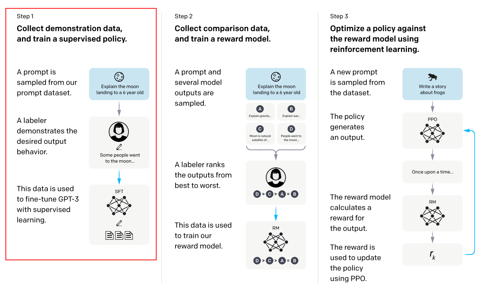

# MindSpeed-RL 监督微调

## 简介

监督微调 SFT（Supervised Fine-Tuning），是一种通过标注数据集对预训练的大型语言模型进行微调的技术。其目的是让模型能够更好地适应特定任务需求。通过在结构化的监督数据上进行训练，SFT
能够让模型更准确地理解和生成内容，例如执行指令、回答问题或提供更精准的对话。

在强化学习中，SFT 一般用来初始化 actor 模型和 reference 模型。



## 使用示例

### 准备环境

请参考首页[安装指南](./install_guide.md)安装环境和准备代码依赖。

### 准备数据

#### 数据下载

* [单轮对话：Alpaca英文数据集](https://huggingface.co/datasets/tatsu-lab/alpaca)

Alpaca风格微调数据集下载可以基于网页直接下载，也可以基于命令行下载，比如：

```bash
cd dataset/
wget https://huggingface.co/datasets/tatsu-lab/alpaca/resolve/main/data/train-00000-of-00001-a09b74b3ef9c3b56.parquet
cd ..
```

#### 数据转换

##### pack格式转换

> 注意：packing格式转换的seq-length需要和SFT训练参数的seq-length保持一致，如果训练参数需要修改，则数据集也需要重新转换。

进入MindSpeed-RL目录，修改 `./configs/datasets/alpaca_instruction_pack.yaml` 文件，并执行如下参考命令

```
bash examples/data/preprocess_data.sh alpaca_instruction_pack
```

##### 非pack格式转换

进入MindSpeed-RL目录，修改 `./configs/datasets/alpaca_instruction_non_pack.yaml` 文件，并执行如下参考命令

```
bash examples/data/preprocess_data.sh alpaca_instruction_non_pack
```

##### 参数说明

【--input】

可以直接输入到数据集目录或具体文件，如果是目录，则处理全部文件, 支持 .parquet \ .csv \ .json \ .jsonl \ .txt \ .arrow 格式，
同一个文件夹下的数据格式需要保持一致

【--map-keys】

`--map-keys`参数用于配置字段映射来使用数据集。

Alpaca风格示例：

```
[
{
    "instruction": "人类指令（必填）",
    "input": "人类输入（选填）",
    "output": "模型回答（必填）",
    "system": "系统提示词（选填）",
    "history": [
    ["第一轮指令（选填）", "第一轮回答（选填）"],
    ["第二轮指令（选填）", "第二轮回答（选填）"]
    ]
}
]
```

对于上面格式的数据，`--map-keys`参数完整应为

`'{"prompt":"instruction","query":"input","response":"output","system":"system","history":"history"}'`

其中参数的key值`"prompt"、"query"、"response"、"system"、"history"`
代表数据集列映射后的属性，在代码中是固定的，不应改变，value值`"instruction"、"input"、"output"、"system"、"history"`对应数据集的列名。

考虑到alpaca数据集大部分都是`["instruction", "input", "output"]`型格式，因此我们为key值`["prompt", "query", "response"]`
设置了默认值。因此上面格式`--map-keys`参数可简略为`'{"system": "system","history": "history"}'`

若数据集中无`system`与`history`列，则`--map-keys`可省略。

【--prompt-type】

用于指定模型模板，能够让base模型微调后能具备更好的对话能力。`prompt-type`
的可选项可以在[templates](../configs/templates.json)文件内查看。

【--handler-name】

微调数据预处理Alpaca风格数据集时，应指定为`AlpacaStyleInstructionHandler`，根据`--map-keys`参数提取对应数据的列。

【--pack】

将数据转为Pack格式。

【--seq-length】

指定Pack数据集每条数据的长度。

【--append-eod】

在每个输入序列的末尾添加一个特殊的标记来表示输入序列的结束。

【--overwrite-cache】

用于控制是否覆盖已存在的缓存分词器。

**示例1：**

```
--map-keys '{"prompt":"notice","query":"question","response":"answer","system":"system_test","history":"histories"}'
```

则会提取数据集里的`"notice"、"question"、"answer"、"system_test"、"histories"`列。

**示例2：**

```
--map-keys '{"history":"histories"}'
```

则会提取数据集里的`"instruction"、"input"、"output"、"histories"`列，其中`"instruction"、"input"、"output"`列作为默认值隐式存在。

### 权重转换

#### 权重下载

* [qwen25-7b](https://huggingface.co/Qwen/Qwen2.5-7B/tree/main)
* [qwen25-32b](https://huggingface.co/Qwen/Qwen2.5-32B/tree/main)

#### hf 转 mcore

在训练前，需要将 Hugging Face 权重转换成 Mcore 格式。

注：这里会调用到 MindSpeed_LLM 仓，进行权重转换时注意按照安装手册中的环境准备步骤，将 mindspeed_llm 放入 MindSpeed-RL 目录下。

```bash
# 路径按照真实情况配置
bash examples/ckpt/ckpt_convert_qwen25_hf2mcore.sh
```

##### 配置参数介绍

* `use-mcore-models`：启用 MCore 模型；
* `model-type`：指定模型类型，如 GPT;
* `load-model-type`：指定加载模型的类型，如 hf（Hugging Face）;
* `save-model-type`：指定保存模型的类型，如 mg;
* `target-tensor-parallel-size`：设置目标张量并行大小；
* `target-pipeline-parallel-size`：设置目标流水线并行大小；
* `add-qkv-bias`：是否进行 QKV 偏置；
* `load-dir`：加载 Hugging Face 权重的路径；
* `save-dir`：保存转换后权重的路径；
* `tokenizer-model`：分词器模型文件的路径；
* `model-type-hf`：指定 Hugging Face 模型类型，如 llama2;
* `params-dtype`：指定参数的数据类型，如 bf16。

#### mcore转hf（可选）

训练结束后，如果需要将生成的mcore格式权重转换回Hugging Face 格式，可以参照以下命令及脚本：

```bash
# 路径按照真实情况配置
bash examples/ckpt/ckpt_convert_qwen25_mcore2hf.sh
```

##### 配置参数介绍

这里的参数与上文基本一致，注意以下几个事项即可：

1. 权重转换转回hugging-face格式时，tp 和 pp 配置需配置为1；
2. load-model-type参数配置为 mg，save-model-type参数配置为hf;
3. save-dir 路径需要填入原始HF模型路径，新权重会存于HF原始权重文件下的mg2hg目录下，如/qwen2.5_7b_hf/mg2hg/

### 开始训练

### 单机

参考[配置](#配置)
，根据真实环境填写路径。进入项目目录后通过 [examples/sft/sft_qwen25_7b.sh](../examples/sft/sft_qwen25_7b.sh)
或者[examples/sft/sft_pack_qwen25_7b.sh](../examples/sft/sft_pack_qwen25_7b.sh) 启动7B模型训练（单机）

### 多机

参考[配置](#配置)，根据真实环境填写路径。
进入项目目录后通过 [examples/sft/sft_qwen25_32b.sh](../examples/sft/sft_qwen25_32b.sh)
或者[examples/sft/sft_pack_qwen25_32b.sh](../examples/sft/sft_pack_qwen25_32b.sh) 启动32B模型训练（多机）
在运行脚本前需要根据真实环境配置脚本中的环境变量

- MASTER_ADDR 主节点的IP
- MASTER_PORT 主节点的端口
- NNODES 参与训练的节点数
- NODE_RANK 该节点在集群内对应的RANK
- GLOO_SOCKET_IFNAME 可以通过 ifconfig 命令，找到本机IP对应的网卡名
- TP_SOCKET_IFNAME，HCCL_SOCKET_IFNAME 可与 GLOO_SOCKET_IFNAME 配置成一样的

在所有需要启动的机器内配置好脚本，在命令行统一运行即可启动多机训练。

### 配置

脚本使用的是configs下的sft_qwen25_7b/sft_qwen25_32b/sft_pack_qwen25_7b/sft_pack_qwen25_32b配置文件

在文件内需要根据真实环境配置

- tokenizer_name_or_path 需配置为 tokenizer对应路径
- data_path 需配置为 \<path\>/\<data prefix\> 的形式，需要保证加载的 bin
  文件的文件名为`<data_prefix>_packed_(.*)_document(.*)`
- tensor_model_parallel_size 张量并行数
- pipeline_model_parallel_size 流水线并行数
- 需要保证并行数乘积能整除总卡数
- 并行配置要与[权重转换](#权重转换)中转换目标的并行配置一致

## 参考集群规模

<table>
  <thead>
    <tr>
      <th>实验模型</th>
      <th>硬件信息</th>
      <th>集群规模</th>
      <th>启动脚本</th>
    </tr>
  </thead>
  <tbody>
    <tr>
      <td rowspan="2">Qwen25-7B</td>
      <td rowspan="2">Atlas 900 A2 PODc</td>
      <td rowspan="2">1x8</td>
      <td><a href="../examples/sft/sft_qwen25_7b.sh">non_pack</a></td>
    </tr>
      <td><a href="../examples/sft/sft_pack_qwen25_7b.sh">pack</a></td>
    <tr>
      <td rowspan="2">Qwen25-32B</td>
      <td rowspan="2">Atlas 900 A2 PODc</td>
      <td rowspan="2">2x8</td>
      <td><a href="../examples/sft/sft_qwen25_32b.sh">non_pack</a></td>
    </tr>
      <td><a href="../examples/sft/sft_pack_qwen25_32b.sh">pack</a></td>
  </tbody>
</table>