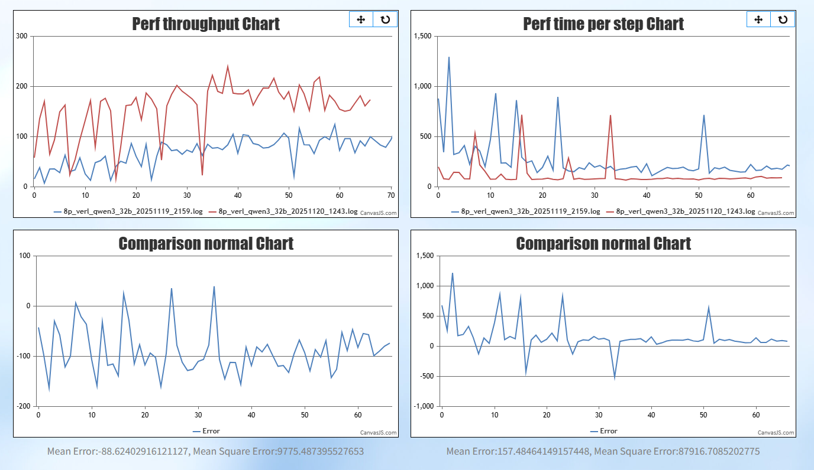

# partial rollout 特性

partial rollout 特性可以降低长序列推理场景下的长尾样本对端到端性能的影响。


## patch使能

需要先按照readme安装verl_npu,使patch生效。


## partial rollout 异步方案

动态确定长尾序列的被截断长度，`rollout_threshold_rate`参数表示当这次推理数量达到`rollout_threshold_rate`比例，就停止推理，将剩下的长尾样本放到下一轮。


### 使能方式 

需要在shell里面添加配置

```shell
    export VERL_AUTO_PADDING=1
    
    actor_rollout_ref.rollout.mode="sync" \
    algorithm.partial_rollout_max_split=2 \
    actor_rollout_ref.rollout.partial_rollout_mode="async" \
    actor_rollout_ref.rollout.rollout_threshold_rate=0.8 \
    actor_rollout_ref.rollout.max_num_batched_tokens=8192 \ # 如果推理开启TP,verl默认参数为response_length+prompt_length,当前版本序列过长会导致问题，需要修改
```
**推荐优先使用异步方案**

## partial rollout 同步方案

根据最大的推理序列长度和次数设置推理的截断点，每次推理的序列长度为，`max_response_length//partial_rollout_max_split`，`partial_rollout_max_split`配置也是跨代迭代最长跨代数量。

### 使能方式

需要在shell里面添加配置

```shell
    export VERL_AUTO_PADDING=1
    
    actor_rollout_ref.rollout.mode="sync" \
    algorithm.partial_rollout_max_split=2 \
    actor_rollout_ref.rollout.partial_rollout_mode="sync" \
```


### 效果验证

使用qwen2.5-7B验证，2k推20k，开关partial rollout性能比较，红色曲线为开启partial rollout，蓝色曲线为关闭partial rollout。



