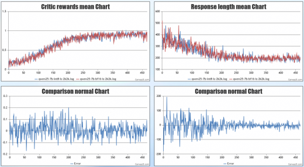
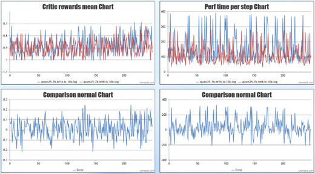

## 在线量化权重：

利用 [Flash-RL](https://github.com/yaof20/Flash-RL) 工具，修改推理后端，通过比较 INT8 模型和 BF16 模型，对权重和激活值执行在线量化。下文以 Qwen2.5-7B int8 为例，在 NPU 上跑通端到端功能。

### 环境依赖

##
| MindSpeed RL版本 | PyTorch版本 | torch_npu版本 | CANN版本  | Python版本 |
| ---------------- | ------------ |-----------| ---------- | ---------- |
| master（主线）   | 2.7.1     | 2.7.1       | 8.2.RC3 | Python3.10 |


#### 1、安装 vllm 和 vllm-ascend
```bash
# vllm==0.10.1
git clone https://github.com/vllm-project/vllm.git
cd vllm
git checkout e03940762b43812fccd3c214bda60201cff9d16a
pip install -r requirements/build.txt
VLLM_TARGET_DEVICE=empty pip install -v .
cd ..

# vllm-ascend==0.10.1
git clone https://github.com/vllm-project/vllm-ascend.git
cd vllm-ascend
git checkout 7e16b4a7cdb15723c63c1c0efe58672a056eace8
pip install -r requirements.txt
export COMPILE_CUSTOM_KERNELS=1	 
python setup.py install
cd ..

# 源码安装transformers
git clone https://github.com/huggingface/transformers.git
cd transformers
git checkout 8365f70e925
pip install -e .
```

#### 2、安装 MindSpeed 与 Megatron
```bash
# MindSpeed
git clone https://gitcode.com/Ascend/MindSpeed.git
cd MindSpeed
git checkout 1cdd0abd75e40936ad31721c092f57c695dd72c4
pip install -e .
cd ..

# Megatron
pip install git+https://github.com/NVIDIA/Megatron-LM.git@core_v0.12.1
```

#### 3、安装 verl
```bash
# verl
git clone https://github.com/volcengine/verl.git
cd verl
git checkout 51d2104ecb61563c41123a8f0bce2f06b18387dc
pip install -e .
cd ..
```

### 使用步骤：

#### 1、安装包：

```
pip install flash-llm-rl # need to be installed in all nodes in multi-node training
```

#### 2、打patch

安装 FlashRL 后，默认采用自动 patch，推荐改用手动方式，减少过程中的错误：

1. 在 `verl/verl/__init__.py` 文件中添加 `import flash_rl`；
2. 在 shell 脚本中添加 `flashrl cleanup`，这将禁用自动 patch；

#### 3、生成性能分析文件

具体来说，profile 文件会比较 bf16 模型和 int8 模型，以确定如何对更新后的模型执行在线量化：

```
flashrl profile -m Qwen/Qwen2.5-7B -q RedHatAI/Qwen2.5-7B-quantized.w8a8 -o ${PROFILE_PATH:-"$HOME/profile.7b.pt"} --fn int8
```

`-m` 参数后是 bf16 模型路径，`-q` 参数后是 int8 模型路径，`-o` 参数后是生成文件路径；
[RedHatAI](https://huggingface.co/RedHatAI/collections) 提供了各种量化模型；

#### 4、生成配置文件

通过以下命令生成 yaml 配置文件，供 patch 程序使用：

```
flashrl setup -m RedHatAI/Qwen2.5-7B-quantized.w8a8 -p $HOME/profile.7b.pt --fn int8 -o ${CONFIG_PATH:-"$HOME/.flashrl_config.7b.yaml"}
```

`-m` 参数后是 int8 模型路径，`-p` 参数后是 profile 文件路径，`-o` 参数后是生成文件路径；

（可选）为了缩小 rollout 生成和梯度计算之间的差距，FlashRL 提供了在 DP 工作线程间以混合方式进行 16 位和 8 位 rollout 生成的功能。具体来说，运行以下命令会将第二个配置附加到现有的 yaml 配置文件中。

```
flashrl setup -a --fn bf16 -o ${CONFIG_PATH:-"$HOME/.flashrl_config.7b.yaml"}
```

#### 5、开始训练

脚本中添加以下环境变量：

```
# 打印详细日志，查看是否 patch 成功：
export FLASHRL_LOGGING_LEVEL=DEBUG
# 指定配置文件：
export FLASHRL_CONFIG=$HOME/.flashrl_config.7b.yaml
# 强制 lm-head 使用 bf16，减小精度损失：
export FLASHRL_LMHEAD_FP32=1
```

以上步骤已在 `grpo_qwen25_7b_fsdp_int8_A2.sh` 提供实例，修改模型脚本中的模型路径即可自动执行，有具体问题可根据上述步骤排查；
将 `tests/verl_examples/flash_rl/grpo_qwen25_7b_fsdp_int8_A2.sh` 和 `tests/verl_examples/configs/test_grpo_qwen25_7b_fsdp_int8_A2.sh` 两个文件复制到 verl，使用 verl 框架开启训练：

```
bash ./grpo_qwen25_7b_fsdp_int8_A2.sh
```

### 效果验证
由于量化开销较大，建议仅在模型规模较大（例如 14B 以上，最好是 32B 以上）且 COT 生成时间较长（使用 Math-17k 训练而非 GSM8K 训练）的情况下使用量化 Rollout。

以下实验 bf16 和 int8 均开启[截断重要性采样](https://verl.readthedocs.io/en/latest/algo/rollout_corr.html)，lm-head 均使用 bf16 计算。

#### 精度： 
由于 [GSM8K](https://huggingface.co/datasets/openai/gsm8k/tree/main) 数据集更容易收敛，用于验证精度，红色为 bf16，蓝色为 int8:
<p align="left">
  
</p>

#### 性能：
使用 [Math-17k](https://huggingface.co/datasets/BytedTsinghua-SIA/DAPO-Math-17k) 数据集，用于验证性能，红色为 int8，蓝色为 bf16:
<p align="left">
  
</p>