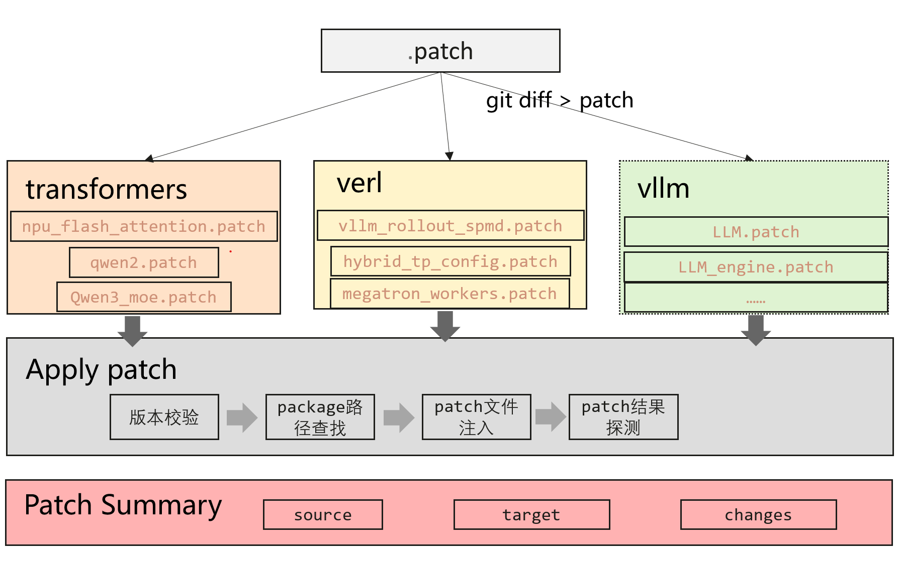

# verl_npu 框架 - 快速开始

## 简介

verl_npu框架提供了一套易用、完整的修改和扩展外部模块的特性。该框架通过patch文件来进行注入，专为 NPU 集成场景设计：

1. **Patch 注入**    - Patch文件注入
2. **Patch Summary** - 对Patch注入结果进行概述
3. **Patch 版本管理** - 对当前依赖库多个版本进行统一
4. **Patch 结果探测** - 探测Patch注入结果

## 架构图

<p align="center">
  
</p>

## 目录结构

```
verl_npu/
├── verl_npu/
│   ├── patch_summary/               # patch概述模块
│   │   ├── __init__.py              
│   │   ├── patch_summary.py         # patch概述模块核心实现
│   │   ├── patch_summary.yaml       # patch概述相关配置
│   ├── patch/                       # patch文件
│   │   ├── transformers/            # transformers相关patch文件  
│   │   ├── verl/                    # verl相关patch文件
│   │── plugin.py                    # patch注入核心逻辑
└── docs/                            # 特性文档
    └── quick_start.md               # 本文档
```

## 开发指南
### 1、Patch文件生成
对verl对应分支进行开发，开发完成后使用`git diff [文件名] > [patch文件名].patch`重定向生成patch文件，以verl仓库的`verl/workers/megatron_workers.py`文件为例：
```python
git diff verl/workers/megatron_workers.py > megatron_workers.patch
```
执行完成后会生成对应的`megatron_workers.patch`文件，将文件移动到`verl_npu/patch/`对应目录下

### 2、patch_summary.yaml配置
`patch_summary.yaml`文件中包含了patch的一些关键信息。其中一些是必填项，一些是选填项，下列以对transformers仓库进行patch为例对配置文件中的所有字段进行解析。
``` python
patches: # 描述patch关键信息
  - repo: transformers # patch的仓库名，可能需要patch多个仓库，用`-`表示当前字段为一个列表，必填
    current_rev: 8365f70e9259c21058bf18f876006f945d2a99de # 表示当前verl_npu进行patch的分支，必填
    versions: # 版本管理，verl_npu中可管理多个版本
      - rev: 8365f70e9259c21058bf18f876006f945d2a99de # transformers当前版本（分支）的commit id，必填
        dir: 8365f70e9 # 对应verl_npu/patch/下的文件夹名称，必填
        files: # patch的所有文件，必填
          - name: npu_flash_attention # 文件名，必填
            diff: # 当前文件改动
              class_changes: # 当前文件所有类改动，对应values值为一个列表，表示npu_flash_attention文件可能存在多个类的修改，选填 
                - action: added # 类改动动作，可参考在[added, replaced, deleted, updated]中选取，也可自定义。
                  name: IndexFirstAxis # 类名
                  changes: # IndexFirstAxis类内的改动，可能包含类属性、类方法等的修改
                    - action: added # 类内改动动作，表示IndexFirstAxis类增加pad_input方法，可参考在[added, replaced, deleted]中选取，也可自定义
                      kind: method # 类内改动类型为方法，可参考在[method, attribute]中选取，也可自定义
                      name: pad_input # 
                - action: added
                  name: IndexPutFirstAxis
              module_changes: # 当前文件所有模块属性改动，对应values值为一个列表，表示npu_flash_attention文件可能存在多个模块属性的修改，
                - action: added # 模块改动动作，可参考在[added, replaced, deleted, updated]中选取，也可自定义。
                  kind: method # 模块改动类型为方法，可参考在[method, attribute]中选取，也可自定义
                  name: unpad_input # 模块属性名
                - action: added
                  kind: method
                  name: _prepare_from_posids
```

### 3、安装verl_npu
修改完毕后，按照`README.MD`中的指引进行`pip install -e .`源码安装插件即可生效（需要提前源码安装`verl` package），如果patch成功，执行`verl`的训练行为时会在日志中打屏幕输出对应的patch详细信息。
如：
``` python
================================ NPU Patch Summary ==================================

================ verl Patch Summary ================

Patch File1: verl.workers.sharding_manager.hybrid_tp_config.py
  (1) Patch class: verl.workers.sharding_manager.hybrid_tp_config.hybrid_tp_config
       Class Changes:
          - added         module_attr         Dict
          - added         module_attr         DictConfig
          - added         module_attr         HybridTPConfig
          - added         module_attr         List
          - added         module_attr         Optional
          - added         module_attr         dataclass

Patch File2: verl.workers.megatron_workers.py
  (1) Patch class: verl.workers.megatron_workers.ActorRolloutRefWorker
       Class Changes:
          - replaced         method         compute_log_prob
          - replaced         method         update_actor

Patch File3: verl.utils.seqlen_balancing.py

Patch File4: verl.workers.rollout.vllm_rollout.vllm_rollout_spmd.py
  (1) Patch class: verl.workers.rollout.vllm_rollout.vllm_rollout_spmd.vLLMRollout
       Class Changes:
          - replaced         method         __init__
          - replaced         method         _init_dp_env

Patch File5: recipe.dapo.dapo_ray_trainer.py
  (1) Patch class: recipe.dapo.dapo_ray_trainer.RayDAPOTrainer

============ verl Patch Summary End ==============

================ transformers Patch Summary ================

Patch File1: src.transformers.models.qwen2.modeling_qwen2.py
   Module Changes:
          - added         method         fused_apply_rotary_pos_emb
  (1) Patch class: src.transformers.models.qwen2.modeling_qwen2.Qwen2RMSNorm
       Class Changes:
          - replaced         method         forward
  (2) Patch class: src.transformers.models.qwen2.modeling_qwen2.Qwen2MLP
       Class Changes:
          - replaced         method         forward

Patch File2: src.transformers.models.qwen3_moe.modeling_qwen3_moe.py
   Module Changes:
          - added         method         apply_rotary_pos_emb
  (1) Patch class: src.transformers.models.qwen3_moe.modeling_qwen3_moe.Qwen3MoeSparseMoeBlock
       Class Changes:
          - replaced         method         __init__
  (2) Patch class: src.transformers.models.qwen3_moe.modeling_qwen3_moe.Qwen3MoeRMSNorm
       Class Changes:
          - replaced         method         forward
  (3) Patch class: src.transformers.models.qwen3_moe.modeling_qwen3_moe.Qwen3MoeMLP
       Class Changes:
          - replaced         method         forward

Patch File3: src.transformers.integrations.npu_flash_attention.py
   Module Changes:
          - added         method         unpad_input
          - added         method         _prepare_from_posids
  (1) Patch class: src.transformers.integrations.npu_flash_attention.IndexFirstAxis
  (2) Patch class: src.transformers.integrations.npu_flash_attention.IndexPutFirstAxis
  (3) Patch class: src.transformers.integrations.npu_flash_attention.pad_input

============ transformers Patch Summary End ==============

============================= NPU Patch Summary End==================================
```