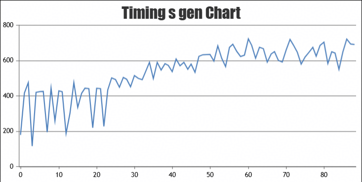

# ReTool on Ascend NPU
本文用于介绍如何在昇腾NPU上运行ReTool，样例基于GRPO与规则奖励，使用AIME_2024数据集。

## 快速开始

### 环境准备
本样例在昇腾A2（单机8卡）设备上进行，可参考[install_guide.md](../../docs/install_guide.md)进行配置。

本样准备源码的步骤如下：
```bash
# verl
git clone -b v0.6.1 https://github.com/volcengine/verl.git
cd ..

# vLLM (v0.11.0)
git clone -b v0.11.0 https://github.com/vllm-project/vllm.git
cd vllm
cd ..

# vLLM-Ascend (v0.11.0-dev)
git clone -b v0.11.0-dev https://github.com/vllm-project/vllm-ascend.git
cd vllm-ascend
cd ..
```

### 准备训练数据集
- 训练数据集(train_files)
BytedTsinghua-SIA/DAPO-Math-17k(https://huggingface.co/datasets/BytedTsinghua-SIA/DAPO-Math-17k)

- 评估数据集(val_files)
AIME_2024或aime_2025
Maxwell-Jia/AIME_2024(https://huggingface.co/datasets/Maxwell-Jia/AIME_2024)
yentinglin/aime_2025(https://huggingface.co/datasets/yentinglin/aime_2025)

### 准备模型权重
Qwen/Qwen2.5-7B-Instruct(https://huggingface.co/Qwen/Qwen2.5-7B-Instruct)

### 执行RL后训练
```bash
# 将 MindSpeed-RL/tests/verl_examples/retool/run_qwen2_7b_dapo_npu.sh复制到verl/recipe/retool目录下，执行脚本
bash ./recipe/retool/run_qwen2_7b_dapo_npu.sh
```

### 训练过程记录
使用qwen2.5-7B验证，2k推20k
<div align="center">
  
  
  
</div>
