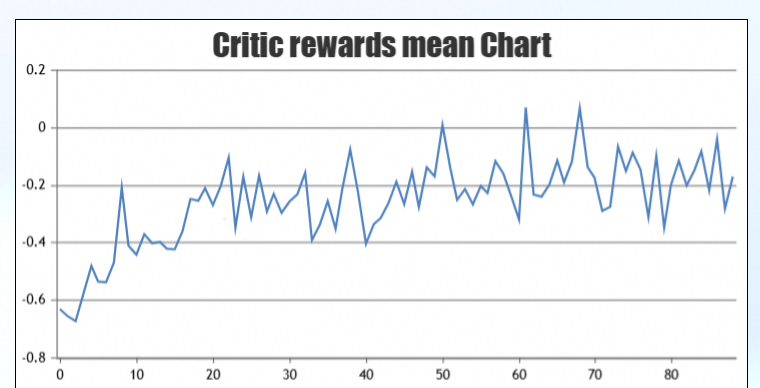
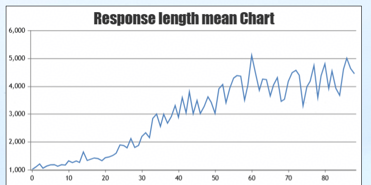
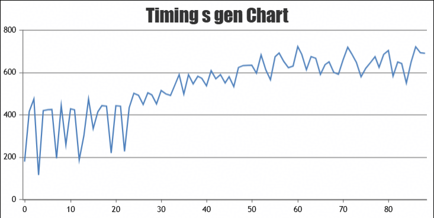

# ReTool on Ascend NPU

ReTool是集成代码解释器工具，通过多轮实时代码执行进行策略部署，并教会模型根据结果反馈学习何时以及如何调用工具。
论文参考 <https://arxiv.org/pdf/2504.11536>
本文用于介绍如何在昇腾NPU上运行ReTool，样例基于GRPO与规则奖励，使用AIME_2024数据集。

## 快速开始

### 1.环境准备

本样例在昇腾A2（单机8卡）设备上进行，环境依赖如下

| MindSpeed RL版本 | PyTorch版本 | torch_npu版本 | CANN版本  | Python版本 |
| ---------------- | ------------ |-----------| ---------- | ---------- |
| master（主线）   | 2.7.1     | 2.7.1       | 8.3.RC1 | Python3.10 |

### 2.代码下载及安装

```bash
# verl
git clone -b v0.6.1 https://github.com/volcengine/verl.git
cd verl
git checkout d62da4950573d7a4b7ef2362337952e7ab59e78d
pip install -r requirements-npu.txt
pip install --no-deps -v -e .
cd ..

# vLLM (v0.11.0)
git clone -b v0.11.0 https://github.com/vllm-project/vllm.git
cd vllm
git checkout b8b302cde434df8c9289a2b465406b47ebab1c2d
pip install numpy==1.26.4
pip install -r requirements/build.txt
VLLM_TARGET_DEVICE=empty pip install -e .
cd ..

# vLLM-Ascend (v0.11.0-dev)
git clone -b v0.11.0-dev https://github.com/vllm-project/vllm-ascend.git
cd vllm-ascend
git checkout ceadc2788da2a3d726d644e27aeaef14c6966405
export COMPILE_CUSTOM_KERNELS=1
pip install -r requirements-dev.txt
# 需要先source CANN包 CANN=8.3.RC1
pip install -v -e .
cd ..
```

### 3.沙箱部署

#### 3.1 开源沙箱代码及部署参考

<https://github.com/bytedance/SandboxFusion>

#### 3.2 代码下载

```bash
git clone -b main https://github.com/bytedance/SandboxFusion.git
```

#### 3.3 沙箱安装

新建终端，进入容器内，在容器内创建sandbox的conda环境

```bash
cd SandboxFusion
conda create -n sandbox -y python=3.10
conda activate sandbox
pip install poetry
```

注意：SandboxFusion里pyproject.toml中python版本要求为3.11，若版本不同需手动修改
执行下列命令，手动拉起沙箱

```bash
poetry lock
poetry install
# to build the real docs, run `cd docs && npm ci && npm run build`
mkdir -p docs/build
cd runtime/python
bash install-python-runtime.sh
cd ..
make run-online
```

#### 3.4 沙箱简单验证

执行命令

```bash
curl 'http://localhost:8080/run_code' -H 'Content-Type: application/json' --data-raw '{"code": "print(\"Hello, world!\")", "language": "python"}'
```

预期结果

```bash
[root@localhost verl] curl 'http://localhost:8080/run_code' -H 'Content-Type: application/json' --data-raw '{"code": "print(\"Hello, world!\")", "language": "python"}'
{"status":"Success","message":"","compile_result":null,"run_result":{"status":"Finished","execution_time":0.018077373504638672,"return_code":0,"stdout":"Hello, world!\n","stderr":""},"executor_pod_name":null,"files":{}}
```

### 4.权重、数据集下载处理

#### 4.1 模型Qwen2.5-7B-Instruct

<https://huggingface.co/Qwen/Qwen2.5-7B-Instruct>

```bash
git clone https://huggingface.co/Qwen/Qwen2.5-7B-Instruct
```

#### 4.2 预处理 ReTool-SFT

无需额外下载
<https://huggingface.co/datasets/JoeYing/ReTool-SFT>

#### 4.3 train data

<https://huggingface.co/datasets/BytedTsinghua-SIA/DAPO-Math-17k>

```bash
git clone https://huggingface.co/datasets/BytedTsinghua-SIA/DAPO-Math-17k
```

#### 4.4 value data

<https://huggingface.co/datasets/Maxwell-Jia/AIME_2024>

```bash
git clone https://huggingface.co/datasets/Maxwell-Jia/AIME_2024
```

### 5.预训练

#### 5.1 sft数据集下载

在verl目录下执行脚本，自动下载ReTool-SFT，最后生成数据默认保存在~/ReTool-SFT/data目录下

```bash
cd verl
python3 recipe/retool/retool_sft_preprocess.py
```

#### 5.2 预训练

修改执行run_qwen2_7b_sft.sh，注意修改适配数据集路径

```bash
bash recipe/retool/run_qwen2_7b_sft.sh
```

#### 5.3 合并预训练后生成的checkpiont

执行脚本合并权重，路径修改为自己权重路径

```bash
python3 -m verl.model_merger merge --backend fsdp --local_dir /home/data/checkpoint/multiturn-sft-qwen-2.5-7b-instruct/global_step_372 --target_dir /home/data/checkpoint/multiturn-sft-qwen-2.5-7b-instruct/global_step_372/huggingface
```

### 6.ReTool工具调用

执行RL后训练，注意适配权重及数据集路径
注意：下载的数据集路径最好保存完整，如{DATA_DIR}/BytedTsinghua-SIA/DAPO-Math-17k，{DATA_DIR}/Maxwell-Jia/AIME_2024，{DATA_DIR}/yentinglin/aime_2025，否则可能导致数据加载不成功报错。

```bash
# 将 MindSpeed-RL/tests/verl_examples/retool/run_qwen2_7b_dapo_npu.sh复制到verl/recipe/retool目录下，执行脚本
bash ./recipe/retool/run_qwen2_7b_dapo_npu.sh
```

### 7.训练过程记录

使用qwen2.5-7B验证，2k推20k
<div align="center">
  
  
  
</div>
